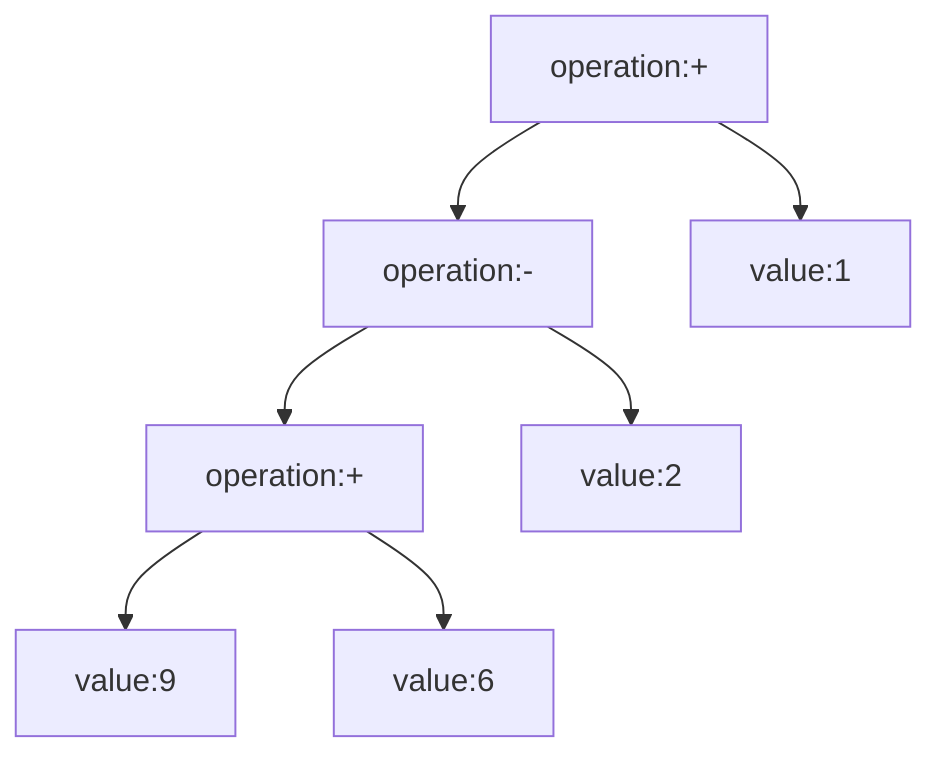

[TOC]

# 设计模式

## 一、UML图简介

UML即统一建模语言，是oop的高度抽象建模表示。

### 1. 类图

在UML中类使用一个包含类名、属性、方法的长方形表示，他们之间用实现分隔。

- 类名：即类的名称，在命名空间中主要用于区别不同的类

- 属性：即类的性质、变量。表达方法为

  ```
  可见性 名称:类型 [ = 默认值]
  ```

  其中，可见性用符号表示：+(public)，-(private)，#(protected)

- 方法：指任一实例对象都可以调用的方法

  ```
  可见性 名称(参数列表) [:返回类型]
  ```

### 2. 关系

在`UML类图`中，常见的有以下几种关系: **泛化（Generalization）, 实现（Realization），关联（Association)，聚合（Aggregation），组合(Composition)，依赖(Dependency)**

1. 泛化：由下至上的抽象，表现为继承

2. 实现：即实现

3. 聚合：表示两个实体对象的整体由部分构成的关系，当说A聚合到B上的时候，b消失了，a不一定消失

   比如 部门B和员工A 用一根空心菱形的实线描述

4. 组合：表示两个实体对象的整体由部分构成的关系，当说A组合到B上的时候，b消失了，a一定消失

   比如 公司B和部门A 用一根实心菱形的实线描述

5. 关联：表示两个对象存在自然的关系，用一根实线表示，如果带上箭头表示单方面知晓这个关系，如A指向B

   表示A知道B，但是B不知道A  比如人和身份证（双向），人与住的大街（单向），一般表现为成员变量

6. 依赖：表示一个对象在运行期间会用到另一个对象的关系，这个关系是临时性的，一般是方法的参数

   由一个虚线带箭头的线段表示，A指向B表示A调用B（B作为参数传入A）

## 二、设计原则

### 单一职责原则

单一职责原则是最简单的oop设计原则，它用于控制类的粒度大小。定义：

`Singel Responsibility Principle,SRP`：一个类只负责一个功能领域中的相应职责。或者可以定义为：就一个类而言，应该只有一个引起它变p化的原因。

### 开闭原则

开闭原则是oop可复用设计的第一块基石。定义：

`Open-Closed Principle,OCP`:一个软件实体应该对扩展开放，对修改关闭。即软件实体应该尽量在不修改原有代码的基础上进行扩展。

### 里氏代换原则

`Liskov Substitution Principle,LSP`：如果对每一个类型为S的对象o1，都有类型为T的对象o2，使得以T定义的所有程序P在所有对象o1都代换成o2时，程序P行为没有变化，那么类型S是类型T的子类型

即是对父类与子类的关系有了定义，运用时应该尽量定义接口或者抽象类为父类，子类实例替换父类实例达到扩展的目的

### 依赖倒转原则

系统抽象化的具体实现，定义如下：

`Dependency Inversion Principle,DIP`：抽象不应该依赖于细节，细节应该依赖于抽象。换言之，要针对接口编程，而不是针对实现编程。

依赖倒转原则要求程序对参数类型的定义是抽象类或者接口这样的高层次抽象，到时候仅仅需要扩展抽象层次代码并由新的子类替换父类实例达到扩展的目的。

- 具体类的对象需要通过依赖注入（Dependency Injection）的方式注入到其他对象中。依赖注入是指的一个对象要与另一个对象发生依赖关系的时候通过抽象来注入所以来的对象。常见的依赖注入方式有3种：
  - 构造注入：利用构造器初始化注入
  - 设值注入：通过setter方法来传入具体类对象
  - 接口注入：通过实现接口的业务方法来传入具体对象

### 接口隔离原则

​	`Interface Segregation Principle,ISP`：使用多个专门的接口而不是单一的总接口。

接口不应太大，承担太多责任，或出现冗余方法；也不应太小，会使得接口泛滥。一般而言，针对某类情况定制接口即可。

### 合成复用原则

合成复用原则又称组合/聚合复用原则

`Composite Reuse Principle,CRP`：尽量使用对象组合，而不是使用继承来达到复用的目的

### 迪米特法则

`Law of Demeter,LoD`：一个软件的实体应该尽可能的少与另一个软件实体产生联系

## 三、设计模式简介

设计模式是对一系列重复性高的问题的抽象解决方案，每个设计模式都具有模式名称、问题、解决方案、效果等要素。

设计模式一般分为三类（GoF）：

- 创建型（Creational）：主要描述如何创建对象								5种+简单工厂模式
- 结构型（Structural）：主要描述如何实现类或对象的组合               7种
- 行为型（Behavioral）：类或对象如何交互以及怎样分配职责          11种

## 四、创建型模式

创建型模式关注对象的创建过程，是一类最常用的设计模式。创建型模式将对象的创建和使用分离，在使用对象时无需关系对象创建细节，从而降低耦合度。每一个创建型模式都需要回答三个问题：

- 创建什么
- 由谁创建
- 创建时间

### 确保对象的唯一性——单例模式

#### 定义

单例模式（Singleton Pattern）：确保某一个类只有一个实例，该类自行实行实例化，并且向整个系统提供这个实例的创建型模式。

#### 目的

对于某些类来说，仅仅需要一个实例就够了（如：任务管理器），对于这部分类来说

1. 客户调用类的单个实例仅仅允许一个公共访问点，除了这个访问点无法通过其他途径访问该实例
2. 出于节省系统资源的角度来说，需要单例类
3. 这部分类的部分处于安全性的考虑，一定需要用单例类

#### 特征

1. 某个类仅仅有一个实例	-----单例
2. 必须自己创建这个实例    -----构造器用private修饰
3. 必须向整个系统提供这个实例    ------获得该实例的方法需要用public修饰

#### 简单的实现

```java
/**
 * <p>这是一个单例类</p>
 */
public class Singleton {
    private static Singleton singleton = null;

    private Singleton() {
    }

    public static Singleton getSingleton(){
        if (singleton == null){
            singleton = new Singleton();
        }
        return singleton;
    }
}
```

#### 高并发时违反单例

在现实业务中，如果并发访问单例类有可能会出现以下问题：

A作为第一个访问的单例类，执行`if (singleton == null)`为`true`，于是开始初始化

同时，B也访问了`if (singleton == null)`，因为实例还在初始化，所以该判断也是`true`，于是B也开始初始化

因此很有可能出现多个实例从而违反了单例模式

#### 饿汉式和懒汉式单例模式

分析上述问题，我们不难发现问题的源头在于：**并发**执行到**初始化**部分，因此解决问题的方法就是从这两点入手

- 饿汉式单例模式

  因为时访问之后再进行的初始化，如果能够在访问之前就将实例初始化好的话------->恰好实例对象是静态的，可以利用类加载时初始化

  ```java
  /**
   * <p>这是一个懒汉式单例类</p>
   */
  public class Singleton {
      private static Singleton singleton = new Singleton();
  
      private Singleton() {
      }
  
      public static Singleton getSingleton(){
          return singleton;
      }
  }
  ```

- 懒汉式单例模式

  因为并发同时访问到初始化------->上锁

  ```java
  /**
   * <p>这是一个懒汉式单例类</p>
   */
  public class Singleton {
      private volatile static Singleton singleton = null;
  
      private Singleton() {
      }
  
      public static Singleton getSingleton() {
          if (singleton == null) {
              synchronized (Singleton.class) {
                  singleton = new Singleton();
              }
          }
          return singleton;
      }
  }
  ```

- 二者优劣

  懒汉式：懒加载运用了锁，将会使系统性能受到影响

  饿汉式：无需考虑并发问题，但是系统加载过程很长，且占用资源

#### IoDH——巧妙结合两者

现在来考虑怎么样能够将两者的有点利用起来：要点就是要**加载的时候完成初始化**且**单例类不调用获得实例方法的时候不去加载**，二者在一个类的情况下是矛盾的，因此就不只有一个类，我们引入一个静态内部类

```java
/**
 * <p>这是IoDH</p>
 */
public class Singleton {
    private Singleton singleton = null;

    private Singleton() {
    }

    private static class SingletonInner {
        private static final Singleton instance = new Singleton();
    }

    public static Singleton getSingleton() {
        return SingletonInner.instance;
    }
}
```

#### 优点、缺点

- 优点
  1. 单例模式提供了对唯一实例的受控访问
  2. 节约资源
  3. 基于单例模式可以写出获得指定个数的多例模式
- 缺点
  1. 没有抽象层，几乎不能扩展
  2. 职责过重：又有业务方法，又有创建方法，违背单一职责
  3. 长时间未使用时可能会被GC回收，再一次建立的单例状态可能不同

### 集中式工厂的实现——简单工厂模式

#### 定义

`Simple Factory Pattern`：定义一个工厂类，它可以根据参数的不同返回不同的实例，被创建的实例通常拥有共同的父类。因为这个创建实例方法是静态的，所以简单工厂模式也叫做静态工厂方法(`Static Factory Method`)模式。

#### 目的

**分离对象的创建和使用**、在使用对象的时候无须关心其创建细节（不会在各个类里面看到某个类创建的数据和代码  -->他们都被移动到工厂类和配置文件中去了）。

#### 创建对象和使用对象

与一个对象相关的职责通常有3类：对象本身的职责（处理内部数据）、创建对象的职责（创建其他对象）、使用对象的职责（使用其他对象）。一般来说，创建对象有以下四种方式

1. 通过`new`关键字创建对象
2. 通过反射机制创建对象
3. 通过`clone()`方法创建对象
4. 通过工厂类创建对象

如果一个类不仅负责创建对象，也负责使用对象它的职责就太重了，比如

```java
public class A{
    private B b;
    
    public A(){
        b = new B();
    }
    
    public void execute(){
        // ...
        b.doSome();
        // ...
    }
}
```

A既负责创建b，也负责使用b，如果某个时候想把B换成类似的C，将不得不修改A里面的源码，违反开闭原则。

#### 特征

1. 一个工厂类根据传入参数负责创建所有产品：有一个根据参数创建实例的方法
2. 多个产品的共性抽象出的公共产品类
3. 每个具体产品实现公共产品。

#### 简单的实现

```java
/**
 * <p>公共产品类</p>
 */
public abstract class Product {
    public void doSome() {
        System.out.println("公共业务方法");
    }

    public abstract void doIn();//具体产品业务方法
}
```

```java
/**
 * <p>具体产品类A</p>
 */
public class ProductA extends Product {
    @Override
    public void doIn() {
        System.out.println("A做了它该做的事情");
    }
}
```

```java
/**
 * <p>具体产品类B</p>
 */
public class ProductB extends Product {
    @Override
    public void doIn() {
        System.out.println("B做了它该做的事情");
    }
}
```

```java
/**
 * <p>工厂类</p>
 */
public class Factory {
    private static Product product = null;

    public static Product getProduct(String type) {
        if (type == "A") {
            product = new ProductA();
        }
        if (type == "B") {
            product = new ProductB();
        }
        return product;
    }
}
```

```java
/**
 * <p>客户端代码</p>
 */
public class Test {
    public static void main(String[] args) {
        Product a = Factory.getProduct("A");
        if (a == null){
            return;
        }
        a.doIn();
    }
}
```

#### 不违背开闭原则的修改getProduct()里面的参数

如果需要进入原代码修改参数（更改生产的对象）的话，将会违背开闭原则。因此关于参数的控制，我们需要在外部的配置文件中控制。

#### 优点、缺点

- 优点：

  1. 分离了对象的创建和消费的过程
  2. 减少使用者的记忆量，配合配置文件的使用加大灵活性

- 缺点：
  1. 工厂类集中了所有创建逻辑细节，是创建的中心，职责过重，一旦出现问题会影响整个系统
  2. 引入工厂类增加了系统复杂度和理解难度
  3. 简单工厂模式因为使用了静态方法，工厂角色无法形成基于继承的等级结构，只能修改源代码
  4. **系统扩展困难，一旦增加了新的产品只能通过修改工厂类源代码，当产品较多时将会造成维护困难**

### 多态工厂的实现——工厂方法模式

#### 定义

`Factory Method Pattern`：定义一个用于创建对象的接口，让其子类决定将哪一个类实例化。工厂模式又称虚拟构造器模式(`Virtual Constructor Pattern`)和多态工厂模式(`Polymorphic`)

#### 目的

简单工厂模式虽然很好的将对象的创建和消费进行了分离，但依然存在新增产品违背开闭原则和初始化创建细节过重的问题，因此为了解决这些问题引入了工厂方法模式。

#### 特征

1. 工厂方法模式是简单工厂方法模式的改进——简单工厂模式为基础
2. 不违背开闭原则新增产生产品的工厂方法代码——所有工厂类需要一个共同的抽象接口：抽象工厂类
3. 多个工厂类生产多个产品——最好的对应方式当然是一一对应
4. 各种创建细节可以在具体的工厂类中处理——在工厂类中处理初始化逻辑和创建细节

#### 简单的实现

```java
//抽象工厂类
public interface Factory {Product createProduct();}
```

```java
//抽象产品类
public interface Product {void doSome();}
```

```java
// 狄拉克工厂类
public class DiracFactory implements Factory {
    @Override
    public Product createProduct() {
        return new Dirac();
    }
}
```

```java
// 棉花糖工厂类
public class MarshmallowFactory implements Factory {
    @Override
    public Product createProduct() {
        // 初始化过程
        return new Marshmallow();
    }
}
```

```java
/**
 * 狄拉克产品
 */
public class Dirac implements Product {

    private final String name = "Dirac";
    private final String symbol = "<|>";

    @Override
    public void doSome() {
        System.out.println(name + "符号就是" + symbol);
    }
}
```

```java
/**
 *  棉花糖产品
 */
public class Marshmallow implements Product{
    @Override
    public void doSome() {
        System.out.println("好吃！");
    }
}
```

```java
/**
 * 客户端
 */
public class Client {
    public static void main(String[] args) {
        Factory factory = new DiracFactory();
        Factory factory2 = new MarshmallowFactory();
        Product product = factory.createProduct();
        product.doSome();					// Dirac符号就是<|>
        product = factory2.createProduct();
        product.doSome();					// 好吃！
    }
}
```

#### 使用反射来创建具体工厂类

仔细思考上面的例子，发现在客户端中不可能全部工厂类都创建一遍，并且不知道到底需要用哪一个，到时候进行修改的时候势必会修改源代码，违背开闭原则，此时使用反射+配置文件来解决这个问题

```yaml
# 到时候读取本配置文件即可
factoryName: DiracFactory
```

```java
// 客户端类
// ... 代码
String factoryName = yamlUtils.getfactoryName;// 这里就是从配置文件里面获取的类名
Class factoryClass = Class.forName("factoryPattern."+factoryName);	// 前面的是包名
Factory o = (Factory)factoryClass.getDeclaredConstructor().newInstance();
Product product = o.createProduct();
product.doSome();
```

#### 优点、缺点

- 优点：
  1. 可以任意不违背开闭原则的情况下创建新的工厂和对应产品
  2. 创建过程完全对客户隐藏，都被封装在工厂类里面了

- 缺点：
  1. 新添加工厂的时候会增加类和接口的个数，增加了系统体量**且一对一的对应方式使得系统体量增速过快**
  2. 引入了新的抽象层，加强了理解难度；运用了反射技术，增加了实现难度

### 产品族的创建——抽象工厂模式

#### 定义

`Abstract Factory Pattern`：提供一个创建一系列或者相互依赖对象的接口，而无须指定它们具体的类。抽象工厂又被称为Kit模式。

#### 目的

在工厂模式中虽然解决了新增产品会违背开闭原则的问题，但是每新增一个产品将会对应多出至少两个类：工厂类和产品类。这样产品一旦多了起来就会使得系统工厂类过于庞大，难以理解和改动。因此我们需要解决这个问题

#### 分析

仔细思考一下，为了解决这种新增产品同时会新增工厂的问题就是让产品和工厂一一对应变成工厂对产品的一对多映射……但是这不得不面对两个问题：

1. 依照什么性质将多种产品放进一个工厂类（也即工厂类根据什么性质分类）
2. 如果要新增加一个产品，不得不修改抽象工厂类的源码，即违背开闭原则

#### 特征

1. 一个工厂不再仅生产一个产品了，而应该根据产品类生产一系列的产品 ----> 抽象工厂中包含多种方法用于生产不用产品
2. 根据某种特征将多种产品封装为一个产品类 ----->需要根据需求设计

#### 简单的实现

现在来考虑一个学科类，它将包含教材和工具两个产品

```java
package abstractFactoryPattern;

/**
 * 产品族抽象工厂类，这里定义多个工厂创建方法
 */
public interface AbstractFactory {
    AbstractSubject createSubject();
    AbstractTools createTools();
}

```

```java
package abstractFactoryPattern;

/**
 * 抽象物品类：科目
 */
public interface AbstractSubject {
    void introduce();
}

```

```java
package abstractFactoryPattern;

/**
 * 抽象物品类：工具
 */
public interface AbstractTools {
    void doSome();
}

```

```java
package abstractFactoryPattern;

/**
 * 语文
 */
public class Chinese implements AbstractSubject{
    @Override
    public void introduce() {
        System.out.println("我是语文");
    }
}
/* -------------------------------产品 ---------------------------------  */
package abstractFactoryPattern;

public class ChineseTools implements AbstractTools {
    @Override
    public void doSome() {
        System.out.println("字典");
    }
}

```

```java
package abstractFactoryPattern;

/**
 * 物理
 */
public class Phy implements AbstractSubject {

    @Override
    public void introduce() {
        System.out.println("我是最好玩的物理");
    }
}
/* -------------------------------产品 ---------------------------------  */
package abstractFactoryPattern;

/**
 * 物理工具
 */
public class PhyTools implements AbstractTools {
    @Override
    public void doSome() {
        System.out.println("仪器");
    }
}

```

```java
package abstractFactoryPattern;

public class ChineseFactory implements AbstractFactory {
    @Override
    public AbstractSubject createSubject() {
        return new Chinese();
    }

    @Override
    public AbstractTools createTools() {
        return new ChineseTools();
    }
}

```

```java
package abstractFactoryPattern;

public class PhyFactory implements AbstractFactory {
    @Override
    public AbstractSubject createSubject() {
        return new Phy();
    }

    @Override
    public AbstractTools createTools() {
        return new PhyTools();
    }
}

```

```java
package abstractFactoryPattern;

public class Client {
    public static void main(String[] args) {
        AbstractFactory factory = new PhyFactory();
        factory.createSubject().introduce();	//  我是最好玩的物理
        factory.createTools().doSome();			//  仪器
    }
}

```

#### 开闭原则的倾斜

在抽象工厂模式中，我们将多种产品按照某性质分类，形成一个个产品类，每个工厂都含有多个创造产品的方法，每个方法都对应一个产品。

- 工厂类与产品类之间是一一到上映射的关系：所以增加产品类会十分便捷，直接加工厂实现抽象工厂就好
- 工厂类和产品之间是一对多的关系：所以要增加一个新的产品的话，我们将不得不修改源代码，在抽象工厂类里面新增一个产品方法

有些时候一对一的工厂方法模式会带来太多的麻烦，这个时候牺牲开闭原则选择抽象工厂也是不错的选择

（？那么原则的意义到底是什么）

#### 优点、缺点

- 优点：
  1. 当一个产品类中的多个对象被设计在一起时，能保证客户用的都是这一类的对象
  2. 增加新的产品族是很简单的
- 缺点：
  1. 新增一个产品的时候，将不得不修改大量的工厂类甚至抽象工厂类，违背开闭原则

#### 使用场景

总的来说，就是将收益最大化，损失最小化：

- 收益最大化：系统有多个产品类，且每次只使用一种产品类
- 收益最大化：同一个产品类的产品将被设计为在一起使用，不会从各种产品类里面选取产品使用
- 损失最小化：产品类的结构稳定，不会轻易地新增或减少产品

### 对象的克隆——原型模式

在对象的创建过程中有些时候会出现初始化会非常耗时的情况（比如数据库的连接）如果按照工厂模式的创建，每一个新的实例都会花费大致相同的时间和资源，而这些实例的差别可能就只是一个参数的区别。为了大幅度优化后面实例的创建，其实只需要将最先创建出来的实例缓存起来，通过克隆再修改一些参数就能够创建对象了。

#### 定义

`Prototype Pattern`:使用原型实例指定创建对象的种类，并且通过克隆这些原型创建新的对象。

#### 目的

优化费时费事实例的创建(主要是初始化)

#### 分析

所谓克隆，就是复制+粘贴。因为原型已经进行过初始化，所以单纯的克隆状态并不怎么花费资源和时间。其次原型可以是大有区别的复数实例，这样方便克隆出来的实例简单修改就能覆盖所有实例集。

#### 特征

1. 原型模式需要一个原型===>第一个实例用于克隆，不能是原型模式产生的
2. 同一类的对象====>具有相同的状态类型和改变状态的方法（所有方法都具有这个功能）===>克隆自己就好=====>克隆方法返回自己同状态实例，但是内存地址不一样
3. 具有多个原型====>具有相同的克隆方法====>需要一个抽象原型里面实现克隆的方法（java中就是Object类）

#### 简单的实现

1. 通用实现------与代码无关

   ```java
   // ... 具体原型类实现克隆方法
   public Prototype clone(){
   A a = new A();
   a.setAttr(this.attr);	// 具体原型类的状态
   return a
   }
   
   //....
   
   //... 客户端类
   A a = new A(...Object args);	// a的初始化过程，可能很费事或者费时
   a.set(Object obj);	// b的初始话过程，大部分略过去了
   A b = a.clone();	// b的创建
   ```

   

2. java实现-------使用`Object`的`clone()`方法

```java
package prototype;

import lombok.Data;

/**
 * java中的抽象原型类就是Object
 * 具体原型类，
 */
@Data
public class ConcretePrototype implements Cloneable {
    private String name;
    private int age;

    @Override
    public ConcretePrototype clone() throws CloneNotSupportedException {
        return (ConcretePrototype) super.clone();
    }

    public void printSome() {
        System.out.println("**********" + getName() + "**********");
        System.out.println("**********          **********");
        System.out.println("**********          **********");
        System.out.println("**********" + getAge() + "**********");
    }
}

```

```java
package prototype;

public class Client {
    public static void main(String[] args) throws CloneNotSupportedException {
        ConcretePrototype prototype = new ConcretePrototype();
        prototype.setAge(18);
        prototype.setName("周报");
        prototype.printSome();
        System.out.println("----------------------------------");
        ConcretePrototype clone = prototype.clone();
        clone.setName("日报");
        clone.setAge(19);
        clone.printSome();
    }
}
/*
**********周报**********
**********          **********
**********          **********
**********18**********
----------------------------------
**********日报**********
**********          **********
**********          **********
**********19**********
*/
```

#### Java实现的注意点

1. 因为clone方法在Object中的方法是protected的，所以在具体原型类中需要将其提升至public，好让client中使用这个方法
2. 只有实现了Cloneable接口的类才能使用clone方法，所以具体原型类中必须要实现这个标志性接口
3. clone只需要调用父级的clone接口就好了

#### 浅拷贝与深拷贝

- 浅拷贝;基本类型进行拷贝，引用类型直接共享一个地址；**Object的clone方法是浅拷贝**
- 深拷贝：基本类型和引用类型都是拷贝，即引用类型的地址不一样；**java提供的序列化可以做到深拷贝**

#### 深拷贝的实现——序列化

这里简单说说序列化：所谓序列化就是将对象转为流（二进制数据）的过程，将对象序列化再反序列化重新生成的对象和原对象状态完全一致但是是深拷贝。

```java
package prototype;
import lombok.Data;
import java.io.*;
/**
 * 具体原型（也是抽象原型）
 */
@Data
public class DeepPrototype implements Serializable {
    private String name;
    private int age;
    private Object obj;

    public DeepPrototype deepClone() throws IOException, ClassNotFoundException {
        ByteArrayOutputStream bao = new ByteArrayOutputStream();    // 输出流
        ObjectOutputStream oos = new ObjectOutputStream(bao);       // 序列化流，写入到上面的输出流里面
        oos.writeObject(this);                                      // 向序列化流里面写入对象
        // 下面是反序列化
        ByteArrayInputStream bai = new ByteArrayInputStream(bao.toByteArray());
        ObjectInputStream ois = new ObjectInputStream(bai);
        return (DeepPrototype) ois.readObject();
    }
}
```

```java
package prototype;

import java.io.IOException;

public class DeepClient {

    public static void main(String[] args) throws IOException, ClassNotFoundException {
        DeepPrototype prototype = new DeepPrototype();
        prototype.setAge(18);
        prototype.setName("1111");
        prototype.setObj(new Client());	// 注意Client类必须也要实现Serializable接口
        DeepPrototype o = prototype.deepClone();
        System.out.println(o.getObj().equals(prototype.getObj()));	// false 没有实现equals方法
    }
}

```

#### 我自己的另一个实现——抽出了抽象原型类

```java
package prototype;

import java.io.*;
// 抽象原型类
public interface AbstractDeepPrototype extends Serializable {
    default Object deepClone() throws IOException, ClassNotFoundException {
        ByteArrayOutputStream bao = new ByteArrayOutputStream();    // 输出流
        ObjectOutputStream oos = new ObjectOutputStream(bao);       // 序列化流，写入到上面的输出流里面
        oos.writeObject(this);                                      // 向序列化流里面写入对象
        // 下面是反序列化
        ByteArrayInputStream bai = new ByteArrayInputStream(bao.toByteArray());
        ObjectInputStream ois = new ObjectInputStream(bai);
        return  ois.readObject();
    }
}

```

```java
package prototype;

import lombok.Data;

import java.io.*;

/**
 * 具体原型
 */
@Data
public class DeepPrototype implements AbstractDeepPrototype {
    private String name;
    private int age;
    private Student student;

    @Override
    public DeepPrototype deepClone() throws IOException, ClassNotFoundException {
        return (DeepPrototype)AbstractDeepPrototype.super.deepClone();
    }
}

```

```java
package prototype;

import java.io.IOException;

public class DeepClient {

    public static void main(String[] args) throws IOException, ClassNotFoundException {
        DeepPrototype prototype = new DeepPrototype();
        prototype.setAge(18);
        prototype.setName("1111");
        prototype.setStudent(new Student("胡"));
        DeepPrototype o = prototype.deepClone();
        System.out.println(o);	// DeepPrototype(name=1111, age=18, student=Student(name=胡))
        System.out.println(o.getStudent() == prototype.getStudent()); // false
    }
}

```

感觉上面的更简单……话说接口的interface.super到底是什么

#### 原型管理器的引用和实现

考虑到常用的原型越来越多，整理和管理这些原型的管理器就是有必要的

1. 管理器的状态应该是唯一的——单例模式
2. 管理器应该能保存多种原型——用容器装
3. 管理器应该可以得到各种原型的克隆实例——工厂模式：实例的创建使用clone

```java
package prototypeManager;

/**
 * 抽象原型
 */
public interface AbstractPrototype extends Cloneable {
    AbstractPrototype clone();
    // 业务方法
    void display();
}

```

```java
package prototypeManager;
// 具体原型类 忽略其他原型类和属性
public class DayOfficePattern implements AbstractPrototype {
    @Override
    public AbstractPrototype clone() {
        // 克隆方法
        AbstractPrototype abstractPrototype = null;
        try {
            abstractPrototype = (AbstractPrototype) super.clone();
        } catch (Exception e) {
            e.printStackTrace();
        }
        return abstractPrototype;
    }

    @Override
    public void display() {
        // 这里写业务方法
        System.out.println("日报模板");
    }
}

```

```java
package prototypeManager;

import java.util.HashMap;

/**
 * 原型管理器
 */
public class PrototypeManager {
    private HashMap<String, AbstractPrototype> map = new HashMap();
    private static PrototypeManager prototypeManager = new PrototypeManager();

    private PrototypeManager() {
        map.put("day", new DayOfficePattern());
        map.put("week", new WeekOfficePattern());
    }

    public void addPrototype(String name, AbstractPrototype prototype) {
        map.put(name, prototype);
    }

    public AbstractPrototype getPrototype(String name) {
        // 偷懒没写，可以写个try-catch处理空指针异常
        AbstractPrototype clone = null;
        try {
            clone = map.get(name).clone();
        } catch (Exception e) {
            // log.error("没有这样的模板！")
            e.printStackTrace();
        }
        return clone;
    }

    public static PrototypeManager getManager() {
        return prototypeManager;
    }
}

```

```java
package prototypeManager;

public class Client {
    public static void main(String[] args) {
        PrototypeManager manager = PrototypeManager.getManager();
        AbstractPrototype day = manager.getPrototype("day");
        day.display();	//日报模板
        AbstractPrototype week = manager.getPrototype("week");
        week.display();	//周报模板
        AbstractPrototype day1 = manager.getPrototype("day");
        System.out.println(day == day1);	// false
        System.out.println(day.getClass() == day1.getClass());	// true

        AbstractPrototype year = manager.getPrototype("year");
        System.out.println(year);	// null
    }
}

```

#### 优点、缺点

- 优点：
  1. 大大减少了初始化耗费的时间和性能，非常适合创建多个初始化很复杂的实例
  2. 扩展性很强，仅仅需要修改一些属性就可以称为一个新的原型
  3. 结构等级很简单，和简单工厂类似，仅仅需要一个管理器即可控制多个原型，较简单情况下自己就可以作为工厂
  4. 可以使用深拷贝的方式来保存某一时刻的状态，实现撤销、历史步骤的操作
- 缺点：
  1. 需要为每一个具体原型类配备一个克隆方法，并且这个方法位于类的内部，修改违背了开闭原则
  2. 深拷贝的时候代码较为复杂，并且如果对象的属性是另一个对象，这样的嵌套过多的时候，每一个都需要支持深拷贝，实现起来会非常困难

#### 再论实例的创建

可以看出原型模式和工厂模式有了本质的差别——那便是从第二个实例开始是选择再走一遍构造器的方式呢还是直接复制现有的对象来进行更改呢。

事实上，java中创建实例的方法无非2大类：

- 从构造器创建——new和反射的newInstance均属于此类
- 直接复制对象——clone和反序列化读取readObject便属于此类

也因此，如果实例的初始化比较麻烦的时候，从第二个开始的时候使用复制会有很好的优化效果。

### 复杂对象的组装和创建——建造者模式

之前从对象的创建分出了两种创建方式——工厂模式和原型模式，现在我们将视线投向初始化过程中。

如果一个对象的初始化各个属性含有多个比较复杂的对象，属性是否需要初始化，或者属性之间具有相互依赖需要指定顺序的时候，可以考虑将对象的表示和初始化分离开。定好一套固定的每个复杂对象的构造过程，根据不同的表示在对一个的builder类里面选择性的进行属性初始化与否和顺序。

#### 定义

`Builder Pattern`：将一个复杂对象的构建与它的表示分离，使得同样的构建过程可以创建不同的表示。

#### 目的

分离复杂对象的构建过程，使用相同的构建过程来构建不同的产品。

#### 分析

将一个复杂对象的初始化过程分离为另一个类进行这些个复杂部分的初始化，即在另一个builder类里面实现初始化逻辑代码，在director类里面进行生产什么对象和初始化属性

#### 特征

1. 有一个复杂的对象——定义一个Product类，如果有根据产品实现的业务方法，则此类是一个abstract的类
2. 将初始化过程分离开来——需要一个builder类，来控制实现具体那些个属性对应实例的的初始化，并且最后返回这个实例
3. 可能有多种同一类的不同实例（逻辑、顺序不同）——每一个都对应一个builder类，所以抽象出abstractBuilder接口，该接口需要定义两种方法：
   1. ​	初始化各种属性的方法
   2. ​    返回实例对象的方法
4. 最后需要一个和客户沟通，决定调用什么builder，是否构建某个部分——一个director，调用AbstractBuilder的方法

#### 简单实现

```java
package constructPattern;

import lombok.Data;
import lombok.ToString;

/**
 * 产品类
 */
@Data
@ToString
public class Product {
    private String type;
    private String name;
    private String gender;
    private int atk;
    private int def;
}

```

```java
package constructPattern;

/**
 * 抽象builder类，负责定义初始化产品需要的方法：初始化product和返回product
 */
public abstract class AbstractBuilder {
    protected Product product = new Product();

    public abstract void setType();
    public abstract void setName();
    public abstract void setGender();
    public abstract void setAtk();
    public abstract void setDef();

    public Product getInstance(){
        return this.product;
    }
}

```

```java
package constructPattern;

public class LancerBuilder extends AbstractBuilder {
    @Override
    public void setType() {
        product.setType("Lancer");
    }

    @Override
    public void setName() {
        product.setName("KQL");
    }

    @Override
    public void setGender() {
        product.setGender("male");
    }

    @Override
    public void setAtk() {
        product.setAtk(100);
    }

    @Override
    public void setDef() {
        product.setDef(100);
    }
}

```

```java
package constructPattern;

public class Director {
    public Product construct(AbstractBuilder builder) {
        Product product = null;
        builder.setAtk();
        builder.setDef();
        builder.setGender();
        builder.setName();
        builder.setType();
        product = builder.getInstance();
        return product;
    }
}

```

```java
package constructPattern;

public class Client {

    public static void main(String[] args) {
        Director director = new Director();	
        Product product = director.construct(new LancerBuilder());	// Builder可以通过配置修改
        System.out.println(product);
    }
}

```

#### director类的几种变化

- ##### 省略director

  ​	事实上，director和builder的职责是如此之近。前者决定调用哪个builder，并且决定调用逻辑；后者定义了构建逻辑。在一些情况下，完全可以将director的职责封装进builder中。
  ​	这样Builder类就要负责构建出实例，在抽象类中定义construct方法。

  ```java
  // 将director封装进builder中
  // 自己作为参数传给自己肯定可以优化为不传参数直接调，现在将contruct方法设为static的，可以直接根据传入的
  // 参数进行构建
  public abstract class AbstractBuilder {
      protected static Product product = new Product();
  
      public abstract void setType();
      public abstract void setName();
      public abstract void setGender();
      public abstract void setAtk();
      public abstract void setDef();
  
      public static Product construct(AbstractBuilder builder){
          builder.setType();
          builder.setName();
          // ...
          return product;
      }
  }
  // 或者去掉参数
  public abstract class AbstractBuilder {
      protected Product product = new Product();
  
      public abstract void setType();
      public abstract void setName();
      public abstract void setGender();
      public abstract void setAtk();
      public abstract void setDef();
  
      public Product construct(AbstractBuilder builder){
          this.setType();
          this.setName();
          // ...
          return product;
      }
  }
  ```

  ```java
  // 客户端的两种调用方式
  // 第一种方式
  AbstractBuilder ab;
  lb = (LancerBuilder)Utils.getBean("LancerBuilder");
  
  AbstractBuilder.construct(lb);
  // 第二种方式
  AbstractBuilder ab = (LancerBuilder) Utils.getBean("LancerBuilder");
  ab.construct();
  ```

  此时我们简化了建造者模式的结构但是也加重了builder类的职责，如果需要建造的对象确实十分复杂还是建议使用director类进行指导，这样更符合单一职责原则

- 钩子方法

  ​	钩子方法的引入可以使得director更精细地建造对象，钩子函数的返回值一般是boolean类型的，方法名是isXXX()

  它们被定义在抽象builder类中，这样在具体builder中就可以覆盖这个方法在director中根据这个函数返回值来决定是否构建某一个部分或者顺序

  ```java
  // AbstractBuilder
  public abstract boolean isMale();
  // LancerBuilder
  @Override
  public boolean isMale() {
      return true;
  }
  // Director
  if (builder.isMale()) {
      // 男人才有防御
      builder.setDef();
  }
  ```

#### 缺点、优点

1. 优点：
   1. 客户可以不必知道产品内部组成的细节，将产品本身与产品的创建过程解耦，使得相同的创建过程可以创建不同的产品对象
   2. 每一个具体builder都相互独立，可以很方便扩展新的产品
   3. 可以在director里面很精细地控制产品创建地过程
2. 缺点：
   1. 该模式创建地产品必须有较多的共性，组成部分相似，不然不适用
   2. 如果组成产品地内部结构复杂且多变，那么需要大量地具体builder类，增加系统体量和理解难度

#### 适用场景

- 需要生成的产品对象有复杂的内部结构，这些产品对象通常包含多个成员变量
- **需要生成的产品对象属性之间相互依赖，需要指定生成顺序**
- **对象的创建过程独立于创建该对象的类。在建造者模式中通过引入director类将创建过程封装在director类中，而不在建造者类或者客户类中**
- 隔离复杂对象的创建和引用，并使得相同的创建过程可以创建不同的产品

## 五、结构型模式

在oop中，不同的类/对象都具有一定的结构，这些结构决定了它们的职责，而它们的相互协作可以完成复杂的功能。结构型模式（Structural Pattern）关注如何将现有的类和对象组织在一起形成更为强大的结构。

**一般来说，有对象结构模式和类结构模式两种：**

- 类结构模式：关心类的组合，由多个类可以组合成一个更大的系统，在类结构模型中一般是继承和实现关系
- 对象结构模式：关心类与对象的组合，一般是在一个类中使用一个类的实例对象，用该对象调用方法。

因为Java不支持多继承，所以一般以对象结构模式为主

### 不兼容结构的协调——适配器模式

#### 定义

`Adapter Pattern`:将一个接口转换成客户希望的另一个接口，使接口不相容的那些类可以一起工作，别名包装器(Wrapper)。

#### 目的

在开发软件的过程中不可避免地会遇到使用第三方或者丢失了源码的包，如果Client端面向的接口与该第三方包的接口不兼容，且两方都不好修改的情况下，可以考虑时候一个适配器来使得2者兼容。

**也就是说解决的问题目的是:不改动源码的情况下，让两个本无关系的类，其中一个类的方法可以达到另一个类的某个方法的效果**

#### 分析与特征

**如果存在两个类A,B，它们之间没有任何关系，现在想在A中调用a方法实现和B中b方法一样的效果，且二者的代码不便改动的时候，就可以使用适配器模式：适配器C继承A，关联B，重写A的a方法，a中调用B对象的b方法即可（对象适配器，也是委派关系）**

#### 简单实现

-----------------------------------------对象适配器模式-------------------------------------------------

```java
package adapterParrten;
public class Client {
    public static void main(String[] args) {
        Target t = new Adapter();
        t.saySomething();
        System.out.println(t.add());
    }
}
// console 如下所示
/*
本来是写下来的东西，现在是说出来的
错了
0
*/
```

```java
package adapterParrten;
/**
 * 暴露给客户端的接口，声明了客户端需要的方法
 * 如果是类的话适配器继承，如果是接口的话适配器实现
 * 如果全部都是接口的话，适配器可以多实现完成类适配器模式
 */
public interface Target {
    void saySomething();
    int add();
}

```

```java
package adapterParrten;

/**
 * 适配者类，被适配器包裹提供方法
 */
public class Adaptee {
    public void writeSomething(){
        System.out.println("本来是写下来的东西，现在是说出来的");
    }

    public int wrongTake(){
        System.out.println("错了");
        return 0;
    }

    public void noUse(){
        System.out.println("不会用的方法");
    }
}

```

```java
package adapterParrten;

/**
 * 适配器，用来兼容两个本无关系的类
 */
public class Adapter implements Target {
    private Adaptee adaptee;   // 表示包裹这个适配者

    public Adapter(Adaptee adaptee) {
        this.adaptee = adaptee;
    }

    public Adapter() {
        // 默认包裹这个adaptee
        this.adaptee = new Adaptee();
    }

    @Override
    public void saySomething() {
        adaptee.writeSomething();
    }

    @Override
    public int add() {
        return adaptee.wrongTake();
    }
}

```

-----------------------------------------对象适配器模式-------------------------------------------------

-------------------------------------------类适配器模式--------------------------------------------------

因为java并不支持多继承，所以类适配器模式需要以多实现的方式来完成，但是这又会出现很多限制，所以java中一般不会使用类适配器模式、至于如何使用，应该很好想，这里略过

-------------------------------------------类适配器模式--------------------------------------------------

#### 双向适配器模式

注意到适配器实现了Target接口，组合了Adaptee对象，将Target的方法委托给Adaptee对象。而实现、组合都是可以多重的，所以适配器完全可以**同时**实现Adaptee接口，组合Target对象，将Adptee方法委托给Target对象，如此便实现了一个双向适配器，在Target调用Adaptee的方法，在Adaptee调用Target的方法。

```java
public class A implements B,C{
    private B b;
    private C c;
    
    public A (B b){
        this.b = b;
    }
    public A (C c){
        this.c = c;
    }
    public void doSome(){
        b.doSome(); // C调用
    }
    public void writeSome(){
        c.doSome(); // B调用
    }
}
```


#### 缺省适配器模式

注意到如果Target包含大量为实现的方法的话，适配器需要实现里面的所有方法，而这些方法里面的部分方法可能是不需要实现的，因此为了方便适配器的编写，可以引入缺省适配器类先给所有方法一个空实现，真正的具体适配器类再继承它，重写需要实现的方法。

#### 优点、缺点

- 优点：

  1. 将Target和Adaptee类解耦，通过引入一个Adapter类来重现现有Adaptee类，无需修改原结构

     ===========================类适配器模式=================================

  2. 在必要的情况下可以使用适配器重写一些被适配者的方法来实现一些业务

     ===========================对象适配器模式=================================

  2. 一个适配器可以组合多个多个被适配者
  3. 被适配者的子类也可以直接在适配器中使用（里氏代换原则）

- 缺点：
  1. 类适配器模式在java的最大问题就是不能多继承、其次被适配者类不能是final的
  2. 对象适配器模式与类适配器模式相比，想在适配器中置换被适配者类的某些方法比较麻烦。需要新作一个被适配者的子类，（重写方法后）将子类放入适配器中

### 处理多维度变化——桥接模式

#### 定义

`Bridge Pattern`：将抽象部分与其实现部分分离，使他们都可以独立地变化。又称柄体模式或接口模式

#### 目的

分离某个类中耦合的两个操作无关变量（即2维），所谓操作无关指的是在自然、业务关系中两变量不存在任何限制或边界条件。

#### 分析

如果一个类A存在两个维度，那么一定存在一种操作无关的组合结构即——桥接模式。

两个维度分别构建自己的抽象表示——接口或者抽象类，然后对这两个维度进行实现，因为这两个维度要关联起来，所以需要其中一个是**抽象类**，并且组合另一个接口，这就完成了桥接。

#### 特征

1. 多个操作无关的变量：桥接模式一定只适用于可以分离（解耦）的多个变量
2. 多个变量地位等价：因为多个变量之间无关，所以地位等价，都需要一个抽象表示
3. 有一个变量身份不同：虽然地位等价，但是需要一个变量将其他变量组合起来，习惯上是与业务最紧密的那个变量作为抽象类，进行组合。
4. 针对各个抽象表示编程。

#### 简单实现

```java
package bridgePattern;

/**
 * 抽象类，组合其他类并且声明业务方法
 */
public abstract class Abstraction {
    protected Implementor implementor;    // 组合抽象实现类

    public void setImplementor(Implementor implementor) {
        this.implementor = implementor;     // setter注入
    }

    public abstract void doOther();     // 业务方法声明
}

```

```java
package bridgePattern;

/**
 * 实现类接口，声名基本操作即可，业务操作在抽象类中进行
 */
public interface Implementor {
    void doSome();
}

```

```java
package bridgePattern;

/**
 * 具体类，偷懒只写一个了
 */
public class RefineAbstraction extends Abstraction {
    @Override
    public void doOther() {
        implementor.doSome();
    }
    // 其他业务方法
}

```

```java
package bridgePattern;

/**
 * 具体实现类一
 */
public class ConImplOne implements Implementor {
    @Override
    public void doSome() {
        System.out.println("我是具体实现类1");
    }
}

```

```java
package bridgePattern;

/**
 * 具体实现类二
 */
public class ConImplTwo implements Implementor {
    @Override
    public void doSome() {
        System.out.println("我是具体实现类2");
    }
}

```

```java
package bridgePattern;

public class Client {
    public static void main(String[] args) {
        Abstraction abstraction = new RefineAbstraction();
        Implementor implementor = new ConImplOne();

        abstraction.setImplementor(implementor);

        abstraction.doOther(); 			// 我是具体实现类1
    }
}

```

#### 桥接模式和适配器模式的联合使用

在软件开发中，桥接模式和适配器模式经常一起使用，在设计软件的时候，将解耦出的桥接模式里发现某个具体实现类需要使用到不兼容的第三方类，此时就可以在这里使用适配器模式。

#### 优点、缺点

- 优点：桥接模式解耦了抽象和实现的固有绑定关系，打破了多层次继承的编程模式
- 缺点：要求在一开始就在抽象层建立关联关系，所以一开始就得对抽象层编程

### 树形结构的处理——组合模式

<!--不知道是不是可以理解为 整体/部分层次结构和树形结构等价-->

#### 树形结构中的leaf节点和container节点

在树形结构中，有的节点包含子节点我们称为container节点，其他的不包含子节点，我们就称其为leaf节点。组合模式就是专门用来处理这种树形结构的一种结构模式。

#### 定义

`Composite Pattern`：组合多个对象形成树形结构以表示具有“整体——部分”关系的层次结构。组合模式对单个对象(leaf)和组合对象(container)的使用具有一致性。

#### 目的

对于leaf节点和container节点来说，其功能具有较大的不同，在使用这些对象的代码中必须区别对待两者，一般的做法是将二者看作是完全不同的对象，并且编写出的代码经常复杂且冗余。但实际上二者在同一棵树上面自然就具备相似的性质，所以从这一点出发二者也可以看作是一类对象，从而规避因为区别对待带来的复杂代码逻辑——这就是组合模式。

#### 分析

container节点一般来说需要具有add，remove，get三个增删获子节点的方法，其次它的业务方法会递归的调用子节点的业务方法。而leaf节点具有自己的业务方法，不具备add，remove，get三种方法。现在他们在一棵树上，我们完全可以使用一个接口或者抽象类定义上述所有方法。不同的节点自己实现或者继承的时候再按照不同的方式进行不同的实现，这样就体现出了代码中二者的体现。

#### 特征

1. leaf节点和container节点都公用一个接口或者抽象类——该接口或抽象类需要定义所有方法
2. leaf节点不具备增删获取等方法——仅仅需要实现业务方法，其他方法可以直接抛出异常
3. container节点可以包含任意子节点——需要实现增删获得方法，其业务方法是递归调用子节点的业务方法
4. container节点应该聚合下一级子节点——container需要一个容器来装下一级子节点 ====》**这个是该模式的核心**

#### 简单实现

```java
package compositePattern;

/**
 * 文件抽象类，既可能是leaf节点的file，也可能是container节点的folder
 * file: impl operation()
 * folder: impl add(),remove(),get(),operation()
 */
public interface AbstractFiles {
    void add(AbstractFiles file);

    void remove(int i);

    AbstractFiles get(int i);

    void operation();

}

```

```java
package compositePattern;

/**
 * leaf节点，实现AbstractFiles接口
 */
public class MyFiles implements AbstractFiles {
    private String name;

    public MyFiles(String name) {
        this.name = name;
    }

    @Override
    public void add(AbstractFiles file) {
        throw new NotSupportException("files没有新增节点功能");
    }

    @Override
    public void remove(int i) {
        throw new NotSupportException("files没有删除节点功能");

    }

    @Override
    public AbstractFiles get(int i) {
        throw new NotSupportException("files没有获得节点功能");
    }

    @Override
    public void operation() {
        System.out.println("在" + name + "执行了方法");
    }
}

```

```java
package compositePattern;

import java.util.ArrayList;
import java.util.Iterator;

/**
 * container节点，包含下一级节点，递归调用子节点的业务方法
 */
public class MyFolder implements AbstractFiles {
    private ArrayList<AbstractFiles> filesList = new ArrayList<>(); // 聚合接口，完成树形结构
    private String name;

    public MyFolder(String name) {
        this.name = name;
    }

    @Override
    public void add(AbstractFiles file) {
        filesList.add(file);
    }

    @Override
    public void remove(int i) {
        filesList.remove(i);
    }

    @Override
    public AbstractFiles get(int i) {
        return filesList.get(i);
    }

    @Override
    public void operation() {
        // 递归调用子节点的业务方法
        Iterator<AbstractFiles> iterator = filesList.iterator();
        while(iterator.hasNext()){
            iterator.next().operation();
        }
    }
}

```

```java
package compositePattern;

public class Client {
    public static void main(String[] args) {
        AbstractFiles file1, file2, file3, folder1, folder2;
        // 初始化
        file1 = new MyFiles("建筑大全.pdf");
        file2 = new MyFiles("电影.avi");
        file3 = new MyFiles("touhou music best.mp3");
        folder1 = new MyFolder("书籍");
        folder2 = new MyFolder("影音作品");
        try {
            file1.add(file1);	// 捕获异常
        } catch (Exception e) {
            System.out.println(e.getMessage());
        }
        folder1.add(file1);
        folder2.add(file2);
        folder2.add(file3);
        folder2.add(folder1);
        // 调用方法
        folder2.operation();
    }
}
/*
files没有新增节点功能
在建筑大全.pdf执行了方法
在电影.avi执行了方法
在touhou music best.mp3执行了方法
在建筑大全.pdf执行了方法
*/
```

#### 代码的简化

注意到区别二者的子节点管理方法（add，remove，get）在所有leaf节点类中都需要声明异常，为了简化可以

- 将这部分异常声明移至AbstractFiels里面作为默认实现，而container节点重写方法
- 接口中不声明这些方法，将这些方法直接放到container里面，但这将会导致客户端需要面向container节点编程不然无法使用管理子节点的方法

#### 透明组合模式和安全组合模式

在上述组合模式中，leaf和container节点的区别是在具体实现类里面体现出来的。但对于面向AbstractFiles编程的客户端来说，它们并不存在区别，当调用leaf的add方法的时候会报错(如果没有进行相应的处理的话，比如上面的try-catch)，这是不安全的，本节中的简单实现就是透明组合模式。

安全组合模式中，抽象接口不再声明任何管理节点的方法，这些方法由container节点类声明并且实现，这是安全的，但是这些方法将只能通过container类调用而不是之前一致的AbstaractFiles，迫不得已地客户端代码在一些地方需要区别leaf节点和container节点，带来了不便。

在实际编程中，安全组合模式使用的频率更高

#### 优点、缺点

- 优点：
  1. 组合模式可以很清楚的定义分层次的复杂对象，让客户端几乎忽略了单个和局部的区别，更方便
  2. 在组合模式中增加新的节点是符合开闭原则的
- 缺点：
  1. 在container新增节点的时候，很难对这个节点的类型进行限定，需要在运行时检查，这个代码比较复杂

### 拓展系统功能——装饰模式

#### 定义

`Decorator Pattern`：动态的给一个对象增加一些额外的职责，就增加对象功能来说，装饰模式比生成子类实现更为灵活

#### 目的

当某类想进行功能拓展的时候，一般的办法是使用继承在子类中拓展，但当继承不适用的时候（final类或需要拓展的类已经有一些子类，会有大量的修改出现）我们希望找到组合的方式进行拓展。

#### 分析和特征

所谓拓展，就是在原功能的基础上增加新的功能或者增强原有功能。

使用组合的方式来调用原功能的方法就是**委托模式**：维护一个原类的引用，在拓展类中声明一致的方法里调用原类方法。

但是直接这样的话：一是每次拓展都要修改客户端的代码，声明不一致的类，违反开闭原则；二是不如直接复制

为了解决这个问题，我们需要一个抽象接口，让客户端面向这个接口开发。注意到原类和拓展类都具有原类的所有方法，所以非常合适直接抽象出来作为抽象接口，拓展类的引用改为对这个抽象接口的引用，这样拓展类就可以引用**原类和其他所有的拓展类了**。

既然拓展类可以引用其他拓展类，那么在拓展类之上的拓展就可以通过引用其他拓展类来完成，规避了走继承拓展的老路子。

#### 简单实现

```java
package decoratorPattern;

/**
 * 原类 有介绍的功能
 */
public class Face implements AbstractFace {
    @Override
    public void introduce() {
        System.out.println("我是一张脸");
    }
}

```

```java
package decoratorPattern;

/**
 * 抽象脸部类
 */
public interface AbstractFace {
    void introduce();
}

```

```java
package decoratorPattern;

/**
 * 装饰器抽象类
 */
public abstract class DecoratorFace implements AbstractFace {
    private AbstractFace face;


    public DecoratorFace(AbstractFace face) {
        this.face = face;
    }

    @Override
    public void introduce() {
        face.introduce();
    }
}

```

```java
package decoratorPattern;

public class FaceNew extends DecoratorFace {
    public FaceNew(AbstractFace face) {
        super(face);
    }

    @Override
    public void introduce() {
        super.introduce();
        addDes();
    }

    private void addDes() {
        System.out.println("这个是嘴巴");
    }
}

```


```java
package decoratorPattern;

public class Client {
    public static void main(String[] args) {
        AbstractFace face, facenew;
        face = new Face();				// 要被装饰的是谁
        facenew = new FaceNew(face);	// 装饰器是谁
        facenew.introduce();
    }
}
/*
我是一张脸
这个是嘴巴
*/
```

#### 透明装饰模式和半透明装饰模式

在之前的拓展中我们仅仅进行了功能的增强拓展，没有进行功能的增加拓展。事实上如果在拓展类新增一个方法，继续使用抽象类来声明的话，会无法调用这个方法，毕竟没有在抽象类中声明。因此我们不得不使用扩展类来声明拓展对象，这种模式就是半透明装饰模式。

**半透明装饰模式无法对一个对象进行多次装饰**

#### 注意事项

1. 尽量使用透明装饰模式
2. 具体的装饰类尽量是个轻类，职责不要过重，最好通过其他的装饰类进行拓展
3. 如果只有一个原类，抽象类可以作为原类的直接子类

#### 优点、缺点

- 优点：
  1. 装饰模式比继承更灵活，不会导致类的个数急剧增加
  2. 可以对一个对象进行多次装饰，排列组合不同的原类和装饰类得到不同的组合，使得功能灵活强大
- 缺点：
  1. 使用装饰模式进行系统设计将产生很多小对象
  2. 比继承更灵活，但也更容易出错，排错也很苦难可能要一级一级排查

### 提供统一入口——外观模式

#### 定义

`Facade Pattern`：外部与一个子系统的通信通过一个统一的外观角色进行，为子系统中的一组接口提供一个一致的入口，外观模式定义了一个高层接口，这个接口使得这一个系统更容易使用。外观模式又被称为门面模式。

#### 目的

根据单一职责原则，我们将每一个类做到尽可能地轻，这样可以更灵活地复用这些类和降低类之间地耦合。但是我们在组合类来完成一个功能地时候，本质也是在增加耦合的行为。有些时候我们需要n个类的m种组合完成m种功能，如果直接在客户端中组合这些类来完成功能，当修改 或者替换某个类的时候，势必造成这m个功能都要进行修改。为了解决这种高耦合的问题，我们可以将这n个类重新封装到一个新的类中，让客户端面向这个新类编程，当进行修改的时候是对客户端隐藏的——本质是封装。

其次，可以让某些复杂的调用过程被隐藏——还是封装。

#### 分析和特征

其实我们编写的一些类使用了一些第三方的api并且进行了封装也是不自觉得使用了外观模式。

客户端仅仅针对于外观类编程，为了随时更换外观类，可以引入抽象外观类，仅仅定义业务方法，具体外观类进行子系统得引用和委托。

其次一个外观类在系统中有一个就行了，所以可以考虑为单例模式；其次，一个系统中可以设计多个外观类，每个外观类都和一些特定的类交互，向客户提供对应的业务功能。

**外观类的目的就是封装解耦客户端和源码，所有在外观类进行装饰行为都是错误的，违背单一职责。**

#### 简单实现

```java
package facadePattern;

/**
 * 抽象外观类
 */
public interface Abstract {
    void doSome();
}

```

```java
package facadePattern;
/**
 * 业务类A
 */
public class A {
    public void DoA(){
        System.out.println("A做了事");
    }
}
// 业务类B、C省略
```

```java
package facadePattern;

/**
 * 具体外观类
 * 该类可以在系统中仅仅存在一个：单例
 */
public class Facade implements Abstract {
    private static Facade facade;
    private A a;
    private B b;
    private C c;

    private Facade() {
        this.a = new A();
        this.b = new B();
        this.c = new C();
    }

    public static Facade getInstance() {
        if (facade == null) {
            facade = new Facade();
        }
        return facade;
    }

    @Override
    public void doSome() {
        a.DoA();
        b.DoB();
        c.DoC();
    }
}

```

```java
package facadePattern;

public class Client {
    public static void main(String[] args) {
        Facade instance = Facade.getInstance();
        Facade instance2 = Facade.getInstance();
        instance.doSome();
        instance2.doSome();
        System.out.println(instance == instance2);
    }
}
/*
A做了事
B做了事
C做了事
A做了事
B做了事
C做了事
true
*/
```

#### 缺点、优点

- 优点：
  1. 解耦合客户端和系统，使得客户端使用起来更容易，并且子系统之间也没有增加新的耦合关系
  2. 只是提供了一个访问入口，客户端依旧可以灵活地使用子系统
- 缺点：
  1. 不能限制客户端直接使用子类，如果真的做了会大大减少灵活性。
  2. 如果设计不当，增加新的子系统会修改外观类地源码，违背开闭原则。

### 实现对象的复用——享元模式

#### 定义

`FlyWeight Pattern`：运用共享技术有效的支持大量**细颗粒对象**的复用。系统只使用少量的对象，而这些对象都很相似，状态变化很小，可以实现对象的多次复用。又被称为轻量级模式。

#### 目的

当系统出现大量相似的小对象的时候，为了节省内存资源，希望系统可以使用共享的不变的对象，而将变化的部分移到外部。这样就可以将上百的对象转为几个对象。

#### 分析

面对相似的细颗粒对象，将随环境不变的属性抽象出来为**内部状态**；而将那些随环境变化的状态拿出来作为**外部状态**。

如此将仅含内部状态的对象称为享元对象，因为它的状态不随环境的变化而变化，可以放入享元池（储存享元对象的容器）中，需要的时候拿出来即可，以达到复用的效果。

#### 特征

1. 享元对象：会被共享复用的对象，为了保证一致性，内部状态不能被改变，只能提供获得内部属性的方法。其次，因为享元对象应该是少数个的，所以还是需要一个抽象类或者接口来抽象出共性。
2. 抽象享元类：应该声明具体享元类的公共方法和获得内部属性的方法。
   - *注意到享元对象的内部状态不能改变且只提供获得的方法，可以直接将属性转为获得方法中写死，如此就可以不在抽象类中声明属性=》接口。
3. 具体享元类：实现了抽象享元类，其内部可以提供内部状态的存储空间，通常结合单例模式一起设计，为系统提供唯一享元
4. 非共享具体享元类：不是所有实现了抽象享元类的类都需要被共享，这一类就是不需要被共享的（不放入享元池里面的类）类。当需要创建这类对象的时候只需要在客户端代码处new即可。
5. 享元池：所有被创建好了的享元应该放入一个容器中进行保管，当需要的时候通过传入的参数来获得对应的实例对象==》这个听起来像简单工厂模式，所以可以使用简单工厂模式来实现
6. 外部状态的注入，享元只是我们想要的对象的部分，而享元是不能拥有外部状态的任何属性的，所以只能将外部状态作为参数传入享元对应的方法中（定义在抽象类中），并且不能储存。

#### 简单实现

```java
package flyWeightPattern;

/**
 * 抽象享元
 * 仅仅定义公共方法和获得内部状态的方法
 *
 */
public interface AbstractFriend {
    String getName(); // 获得内部状态的方法

    void engage(People people);  // 业务方法
}

```

```java
package flyWeightPattern;

public class FriendOne implements AbstractFriend {
    @Override
    public String getName() {
        return "Clown Piece";   // 内部属性 name="Clown piece"的等价写法
    }

    @Override
    public void engage(People people) {
        System.out.println(people.getName() + "开始向" + getName() + "宣誓");    // 这里的name是外部状态
    }
}

```

```java
package flyWeightPattern;

import java.util.HashMap;

/**
 * 享元工厂，主要完成享元池的功能
 */
public class FlyWeightFactory {
    private static HashMap<String,AbstractFriend> map = new HashMap<>();
    private static FlyWeightFactory factory = new FlyWeightFactory();

    private FlyWeightFactory() {
        map.put("th15_5b",new FriendOne());	// th15:东方绀珠传 5b:stage5 bottom 我无敌的英语
    }

    public static FlyWeightFactory getInstance(){
        return factory;
    }

    public AbstractFriend getFriend(String name){
        return map.get(name);
    }

    // 还可以继续实现向享元池里面新增享元对象
}

```

```java
package flyWeightPattern;

public class Client {
    public static void main(String[] args) {
        FlyWeightFactory factory = FlyWeightFactory.getInstance();
        AbstractFriend clown = factory.getFriend("th15_5b");
        System.out.println(clown.getName());
        People people = new People();
        people.setName("Nona9961");
        clown.engage(people);
    }
}

```

#### 单纯享元模式和复合享元模式

在标准的享元模式中，具体享元类可以是享元的，也可以是非享元的。在这些模式中有两种比较特殊的模式：单纯享元模式和复合享元模式。

##### 单纯享元模式

单纯享元模式：指所有具体享元类都是享元的，可以使用抽象享元类声明一切，很方便

##### 复合享元模式

复合享元模式：有些时候我们希望为多个内部状态不同的享元对象设置相同的外部状态，这个时候需要一个类做的事：

1. 拿到多个享元对象，使用一个容器装起来。————这意味着它具有状态，是非分享的。
2. 存在一个方法，接收外部状态，对每一个享元对象执行业务方法时，注入相同的外部状态。

重看这个类，是享元对象的容器，具备一个方法以委托形式来调用享元对象的业务方法。典型的树形结构——**使用组合模式实现。**

#### 享元模式和其他模式的联系

1. 享元池通常使用一个**单例**，**简单工厂**模式实现
2. 和组合模式一起可以形成复合享元模式，为所有leaf的享元对象设置相同的外部状态

#### 优点、缺点

- 优点
  1. 极大得减少对象数量
  2. 外部状态不会影响内部状态
- 缺点
  1. 要将部分属性抽象为外部状态，增加复杂性
  2. 从外部状态中读取属性会将读取时间加长

#### 环境

- 出现大量相似对象的时候
- 可以将大部分属性抽离出来成为外部状态的时候
- 工厂类会占据一部分资源，当对象多次被用到时才值得使用享元模式

### 对象的间接访问——代理模式

#### 定义

`Porxy Pattern`：给某一个对象提供一个代理，并由代理对象控制对原对象的引用。

#### 目的

代理模式的唯一目的就是控制真实对象的访问，所谓控制即：是否能访问、访问什么方法、是否加上其他功能、是否真的访问等等等等

#### 与装饰器模式的区别

虽然代理模式的目的是控制访问对象，但不可避免的发现代理模式确实可以加强对象的功能，不论是新增方法还是增强方法。这和装饰器模式一样，那么代理模式是否可以替代装饰器模式呢？

肯定是不行的，回忆一下代理模式和装饰器模式的目的和类图就知道了：

- 代理模式：见上，代理类引用地真实类
- 装饰器模式：继承的替代方法，**装饰器引用的是抽象类**，可以有效地解决不可继承和**继承增长、修改爆炸问题**

事实上，代理模式就无法处理继承增长和修改爆炸问题，如果A被B代理，B被C1代理，C1被D1代理，B又被C2代理，现在想用E代理C1,C2使用它们的功能，一旦修改C1为C3，全部都要修改

#### 分析与特征

代理模式的类图很简单，思想也很简单，就是给客户端的不是真的要访问的对象，仅仅是它的一个代理，然后使用这个代理进行一系列操作。而这些操作对客户端不可见，客户一直以为操作的就是真实对象。

因为客户端无需区分真实对象和代理对象，而代理对象能够委托真实对象完成功能，所以我们需要一个抽象接口定义所有业务方法，代理对象应该维护一个真实对象的引用，用于委托。（这个类图和装饰器模式十分相像）

正因为代理模式的简单和强大，所以它能完成很多事情：

1. 远程代理：为一个位于不同的地址空间的对象提供一个本地的代理对象，这个不同的地址空间可以在同一个主机中，也可以在另一台主机中。远程代理又被称为大使(`Ambassador`)
2. 虚拟代理：如果需要创建一个资源消耗比较大的对象，可以先创建一个资源消耗很小的代理对象进行表示，等到需要用到的时候再创建大对象
3. 保护代理：控制对一个对象的访问，可以给不同角色不同的访问权限
4. 缓冲代理：为某一个目标操作的结果提供临时储存空间，以便多个客户端可以共享这些结果
5. 智能引用代理：当一个对象被引用时，提供一些额外的操作，比如打印日志或记录调用次数
6. 同步代理：在多线程的情况下为主题提供安全的访问
7. 复杂隐藏代理：用来隐藏一个类的复杂度并进行访问控制，类似于外观模式，但代理模式控制访问，他们不同
8. 写入时复制代理：用来控制对象的复制，延迟到客户真正需要为止，例子是Java5的CopyOnWriteList

#### 几个常用代理

##### 一般代理模式——所有代理模式的基础

```java
package proxyPattern;

public class Client {
    public static void main(String[] args) {
        Abstract matter = new Proxy();
        matter.intro();
    }
}

```

```java
package proxyPattern;

/**
 * 真实对象
 */
public class RealMatter implements Abstract {
    @Override
    public void intro() {
        System.out.println("我是真实对象");
    }
}

```

```java
package proxyPattern;

public class Proxy implements Abstract {
    private RealMatter realMatter = new RealMatter();
    @Override
    public void intro() {
        realMatter.intro();
        System.out.println("但是这个介绍是代理类说的");
    }
}

```

```java
package proxyPattern;

/**
 * 面向客户端编程的接口
 */
public interface Abstract {
    void intro();
}

```

##### 远程代理——代理远程对象

远程代理就是通过对本机代理对象的访问获得远程对象相应访问获得的数据。实际上网络访问等都是代理对象进行的，但对客户不可见

java中可以使用RMI机制进行远程代理，它能实现一个JVM对象对另外一个JVM对象的调用。在RMI中，客户端通过一个Stub（桩对象）与远程的Skeleton（骨架对象）通信，完成对业务对象的调用，一般分为以下几步：

1. 客户端发起请求，将请求转交给RMI客户端的Stub类
2. Stub将请求的接口、方法、参数等信息序列化
3. 将序列化好的流使用Socket传至服务器
4. 服务器转发给相应的Skeleton类
5. Skeleton反序列化后调用实际的业务处理类
6. 业务处理类将处理后的结果返给Skeleton类
7. Skeleton类序列化结果，返给Stub
8. Stub反序列化结果，将得到的Object返回给客户端

##### 虚拟代理——代理大对象

1. 当系统启动的时候，由于对象的复杂或者网络原因，大对象可能需要比较久的时间。此时可以考虑使用代理加多线程的模式加速系统启动。系统启动的时候，代理对象初始化即可，另一个线程（可以在代理对象中开启）用于加载大对象，当需要用到大对象的时候，一般来说大对象已经加载完毕，通过代理对象调用即可。

2. 当系统面对开销比较大的对象的时候，可以考虑使用一个开销很小的代理对象作为这个大对象的代理，直到必要的时候再由代理对象实例化大对象，并且将客户的请求转发给大对象。

##### 保护代理——控制访问权限

根据访问对象的角色，控制可以访问的方法，这就是保护代理。现在有以下3个设计方法

- 将所有情况都写入一个代理类中，好处是代理类少，但缺点是职责太重，而且需要新增角色就会更改源码
- 将各种情况写入不同的代理类中，好处是可以解耦不同代理类之间的关系，缺点是类的增多对系统的压力较大
- 对代理类使用外观模式——没真尝试过，感觉可以——但是代码会比较复杂

但无论是哪一种设计，代理类都是在编译期间就已经决定好的事情，这种静态代理带来了麻烦，所以我们就想要进行动态代理。

#### 动态代理

动态代理的目的就是**根据真实类对象**，动态地为它创建一个代理类，这意味着这个真实对象一开始是没有对应的代理类的。那么如何做到呢？

首先，动态生成的代理对象一定是通过某个已经写好的类的方法产生的，在JDK中这个类叫Proxy，其他的有cglib等。

其次，万变不离其宗，我们回忆一下代理类究竟有什么，做了什么事。

代理类要维护一个真实类的引用，然后代理类要对这个真实对象的访问进行控制=》也就是对真实对象的方法进行操纵。

**因为是根据真实对象生成的代理类，所以引用可以自动完成**，那么我们真正需要注意的就是对方法操纵。**此时已经把引用和对方法的操作解耦。**

注意到即使是用的动态代理，它依旧是一个代理对象，在客户眼中，它就是真实对象，那么这个动态对象必须**实现真实对象的所有接口**以方便客户调用方法。

最后在客户端中，调用方法的时候依旧是**`a.fun(obj);`**这样调用，其中a是动态生成的代理对象。对方法的操纵不可能是动态生成的，这一部分必须要我们自己来写，然而不同真实对象的方法几乎不一样，要解决这个问题，不同的动态代理方式有不同的实现，下面主要说jdk的实现方式。

##### JDK的动态代理原理

先说生成动态对象的方法：JDK通过`Proxy`类的静态方法`newProxyInstance()`来动态的生成代理对象。现在来考虑一下如何把动态对象和真实对象关联起来，一个很自然的想法就是把真实对象当作一个参数传入进方法里面。很可惜，Proxy类没有这么做，仔细想想我们获得真实对象的引用其实只是为了在必要的时候访问它，JDK的思想是Proxy类仅仅确定动态类的方法有哪些，所以没必要把这个对象的引用放在newProxyInstance职责中。这个静态方法的第一参数就是真实对象类的类加载器（真实对象的全部信息）、第二个参数是代理需要实现的接口（一些额外需要实现的接口）、和第三个参数就是把解耦的操作方法的类。

按照上文所述，不同的对象生成的代理对象对方法的处理自然不同，然而客户的调用方式还是没有变化`a.fun(obj);`，这就逼得代理对象必须获得**调用方法的唯一特征——签名，即方法名和参数**来辨别到底是调用了什么方法（反射）。

最后就是针对不同方法的不同处理，这部分是由我们自己编写的，既然要用获得的签名来编写，jdk已经为我们准备好了标准——`InvocationHandler`接口。这个接口里面仅仅定义了唯一一个方法`invoke(Proxy proxy,Method method,Object[] args)`（这个接口自然就是函数式接口）。注意到这个方法后面两个参数就是被调用方法的签名，第一个参数其实是当前的动态对象，这是为了在`fun`方法中可以调用动态对象其他方法而准备的。**其次，在实现方法操作的时候会访问真实对象，所以真实对象的引用是在`InvocationHandler`实现类中维护的**。

现在可以总结一下动态对象到底是如何生成的了：

1. 首先为了生成动态对象，我们需要`Proxy.newProxyInstance()`方法，生成一个动态对象
2. 这个动态对象需要知道真实对象有的方法和其他接口需要实现的方法以及用哪个`InvocationHandler`来处理方法
3. 所以之前需要实现`InvocationHandler`接口，重写invoke方法，并且获得真实对象的引用，来完成访问控制。
4. `InvocationHandler`作为一个引用塞进了Proxy类中，动态代理类要获得这个`InvocationHandler`，JDK的做法是动态代理类继承了Proxy类，动态代理类的所有待实现的业务方法都是委托调用了`InvocationHandler`的`invoke`方法
5. 调用真实类方法的时候，使用method.invoke()方法，第一个参数传真实对象（由`InvocationHandler`维护），第二个是args

有几个注意的地方：

- JDK的代理类已经继承了Proxy，所以无法继承真实类，这逼得真实类必须要实现一个接口，才能让代理类拿到真实类的方法
- 代理类不继承Proxy，直接引用InvocationHandler类也是可以实现动态代理的……


##### 简单实现

```java
package proxyPattern.dyProxy;

public interface Person {
    boolean intro();
}

```

```java
package proxyPattern.dyProxy;

import lombok.AllArgsConstructor;
import lombok.Data;
import lombok.NoArgsConstructor;


@Data
@AllArgsConstructor
@NoArgsConstructor
public class PersonImpl implements Person {
    private String name;

    @Override
    public boolean intro() {
        System.out.println(name);
        return true;
    }
}

```

```java
package proxyPattern.dyProxy;

import java.lang.reflect.InvocationHandler;
import java.lang.reflect.Method;

public class PersonalHandle implements InvocationHandler {
    private Person person;

    public PersonalHandle(Person person) {
        this.person = person;
    }

    @Override
    public Object invoke(Object proxy, Method method, Object[] args) throws Throwable {
        if (method.getName().equals("intro")) {
            System.out.println("你被代理了");
            return method.invoke(person,args);
        }
        return null;
    }
}

```

```java
package proxyPattern.dyProxy;

import java.lang.reflect.Proxy;

public class Client {
    public static void main(String[] args) {
        Person person = new PersonImpl("任博");
        Person personProxy = (Person)Proxy.newProxyInstance(person.getClass().getClassLoader(),
                person.getClass().getInterfaces(), new PersonalHandle(person));
        boolean intro = personProxy.intro();
        System.out.println(intro);
    }
}

```

#### 优点、缺点

- 优点：
  1. 代理模式能够协调调用者和被调用者，在一定程度上降低了耦合
  2. 代理模式控制真实对象的访问，可以完成大量工作
- 缺点：
  1. 代理对象的出现会增加系统复杂度，消耗一定时间和资源

##  六、行为型模式

行为型模式（Behavioral Pattern）关注系统中对象之间的交互，进一步明确对象的职责。行为型模式不仅关注类和对象本身，还重点关注它们之间的互相作用和职责划分。

### 请求的链式处理——职责链模式

#### 定义

`Chain of Responsibility Pattern`：避免将请求发送者和接收者耦合在一起，让多个对象都有机会接受请求，将这些对象连接成一条链，并且沿着这条链传递请求，直到有对象处理为止。

#### 分析

职责链主要处理这一类问题：有一个请求，根据请求的状态（一般是大小）不同，分给不同的角色去处理这个请求。

一个最简单的实现方法是在一个类里面使用if条件语句判断请求的状态，进行处理。但是一旦需要增加角色，或者需要修改就势必会更改源代码、其次客户端不能灵活定制处理流程：比如根据状态的不同，写为A->B->C->D来处理，（此时A->B表示if（A不处理）->判断B的if），不能让客户端简单的改为A->C->D，而需要修改源码。

注意到每一个if语句块干的都是同一件事：即要处理吗，处理就内部消化，不处理就给下一个人。这样就能把一个类分解为多个，让一个对象维护下一个对象，并且能够解决上面说的修改、增删问题。


所以，所谓职责链就是对象面对请求时选择处理还是不处理，如果不处理将请求转发给下一个对象，直到处理为止。如此就形成了一条链。

#### 特征

1. 每一个类都干同样的事情 ===>很适合抽象一个抽象类出来
2. 每一个类都需要维护下一个类的引用 ====>数据结构的链
3. 职责链的构建（谁维护谁）不能由自己实现，不然2个对象就有了耦合 ====>让第三方来构建

#### 简单实现

```java
package chainOfResponsibilityPattern;

public abstract class Handler {
    protected Handler successor; // 维护的下一个处理者

    public void setSuccessor(Handler successor) {
        this.successor = successor;
    }

    public abstract void doSome(String request);    // 处理请求的类
}

```

```java
package chainOfResponsibilityPattern;

/**
 * 具体处理类 继承抽象类并且进行业务逻辑处理
 *
 */
public class ConcreteHandler extends Handler {

    @Override
    public void doSome(String request) {
        if (request.startsWith("N")){
            // 处理以N开头的字符串
            System.out.println(request.substring(1));
        }else {
            successor.doSome(request);  // 交由下一个处理者处理
        }
    }
}

```

```java
package chainOfResponsibilityPattern;

/**
 * 具体处理者，在另一个之后
 */
public class ConcreteHandler_Succ extends Handler{
    @Override
    public void doSome(String request) {
        if (request.startsWith("W")){
            System.out.println(request+"你是第二节点处理的");
        }else{
            successor.doSome(request);
        }
    }
}

```

```java
package chainOfResponsibilityPattern;

/**
 * 最终处理类，处理前面都无法处理的东西
 */
public class ConcreteHandler_End extends Handler {
    @Override
    public void doSome(String request) {
        System.out.println("无法处理");
    }
}

```

```java
package chainOfResponsibilityPattern;

public class Client {
    public static void main(String[] args) {
        Handler one, two, three;
        one = new ConcreteHandler();
        two = new ConcreteHandler_Succ();
        three = new ConcreteHandler_End();

        // 构建职责链
        one.setSuccessor(two);
        two.setSuccessor(three);

        one.doSome("No,I only find o");	//	o,I only find o
        one.doSome("Wow~");			   //  Wow~你是第二节点处理的
        one.doSome("ow~");			   //  无法处理
    }
}
```

注意到增删改一个具体处理类都可以只修改客户端代码（构建过程），源代码最多拓展新的具体处理类，而不会违背开闭原则。

#### 纯与不纯的职责链模式

在一些情况下，请求仅仅会被且一定被一个类进行处理，这样的处理方式对应的就是纯职责链模式
而在另一些情况下，请求可能会被前一个处理者处理一部分，再被后续的类进行处理；也可能前一个处理完成，后面的类还可以继续处理这个请求；甚至根本不会有类处理这个请求。（js的事件处理就是这样的）

#### 优点、缺点

- 优点
  1. 系统的对象不需要知道到底是谁处理请求，总之相信会被处理（不纯中不一定，但对象相信这一点），也无需知道链的结构是怎么样的，这个由客户端决定，大大的降低了耦合度。
  2. 链结构优点他都有
  3. 增删改具体处理类的时候，符合开闭原则
- 缺点
  1. 因为由客户端构建职责链可能出现不被正确转发的情况
  2. 有可能不被处理
  3. 职责链较长时，增加资源消耗
  4. 有可能造成循环

### 请求发送者和接收者解耦——命令模式

#### 定义

`Command Pattern`：将一个请求封装为一个对象，从而可用不同的请求对客户进行参数化；对请求排队或者记录请求日志，以及支持可撤销的操作。命令模式是一种对象行为型模式，其别名动作模式、事务模式。

#### 分析

一般情况下，两个类AB之间的调用关系是由逻辑、自然定下来的。在这个过程中AB需要完成了以下两件事：

1. A先确定好参数，向B传输参数
2. B接收参数，按照参数调用方法（什么方法可以算在参数里面）

现在考虑这么一种情况，A向谁发送数据是动态决定的，AB不再具有因自然、逻辑定下来的调用关系，此时直接在A中引用B是不合适的，需要第三类来接收A的数据并且根据客户设置转发给B（在A中决定向谁发数据的话职责太重），不妨设这个第三类为M。

现在ABM的职责为：

1. A确定参数，向M发送数据
2. M根据客户设置转发给B
3. B完成业务

如此下来，A与B原本的耦合关系就被解开了。命令模式的目的就是请求发送者不需要知道具体是谁处理它发出请求。

#### 特征

1. 需要一个抽象接口Command，里面仅声明一个方法，用来将A传过来的请求委托出去（注意到这可能是一个函数式接口）
2. 需要A，它将维护一个Command引用，A发出去的请求都是扔给Command，不需要知道到底是谁处理这个请求
3. 需要B，它是处理A请求的具体处理类
4. 需要ConcreteCommand类实现Command，维护对应的具体处理类的引用，将A的请求委托给B处理
5. 具体A向哪一个ConcreteCommand类发送请求由客户端代码决定（或者配置文件）

注意到一件很重要的事情：**从4可以看出来，事实上我们把命令对象和处理对象一起给封装了起来**

#### 简单实现

```java
package commandPattern;

/**
 * 抽象命令接口，仅仅需要一个方法用来转送委托
 */
public interface AbstractCommand {
    void execute();
}

```

```java
package commandPattern;

/**
 * 具体命令类，维护一个对应处理类的引用
 */
public class ConcreteCommand implements AbstractCommand {
    private Handler handler;

    public ConcreteCommand() {
        handler = new Handler("Nona");
    }

    @Override
    public void execute() {
        handler.display("996");
    }
}

```

```java
package commandPattern;

/**
 * 请求发送类 A类
 */
public class Sender {
    private AbstractCommand command;

    public void setCommand(AbstractCommand command) {
        this.command = command;
    }

    public void send(){
        command.execute();
    }
}

```

```java
package commandPattern;

/**
 * 处理类，即B类
 */
public class Handler {
    private String name;
    private final int score = 1;

    public Handler(String name) {
        this.name = name;
    }

    public void display(String str) {
        System.out.println(name + str + score);
    }
}

```

```java
package commandPattern;

public class Client {
    public static void main(String[] args) {
        AbstractCommand command = new ConcreteCommand();
        Sender sender = new Sender();
        sender.setCommand(command);
        sender.send();	// Nona9961
    }
}

```

#### 命令队列

如果一个请求不仅仅是给一个接收者（command）处理，可以引入一个命令队列。

命令队列的实现有多种方式，其中比较简单和灵活的一种就是使用一个ArrayList当容器来完成

```java
package commandPattern;

import java.util.ArrayList;

/**
 * 命令队列
 */
public class CommandQueen {
    private ArrayList<AbstractCommand> commands = new ArrayList<>();

    public void addCommand(AbstractCommand command){
        commands.add(command);
    }

    public void removeCommand(AbstractCommand command){
        commands.remove(command);
    }

    public void execute(){
        for (AbstractCommand command : commands) {
            command.execute();
        }
    }
}

```

```java
package commandPattern;

/**
 * 请求发送类 A类
 */
public class Sender {
//    private AbstractCommand command;
//
//    public void setCommand(AbstractCommand command) {
//        this.command = command;
//    }
//
//    public void send(){
//        command.execute();
//    }
    private CommandQueen commandQueen;	// 针对队列编程

    public void setCommandQueen(CommandQueen commandQueen) {
        this.commandQueen = commandQueen;
    }
        public void send(){
        commandQueen.execute();
    }

}

```

```java
package commandPattern;

public class Client {
    public static void main(String[] args) {
        CommandQueen queen = new CommandQueen();    // 新增命令队列
        AbstractCommand command = new ConcreteCommand();
        Sender sender = new Sender();
        
        queen.addCommand(command);  // 将command放入队列中
        sender.setCommandQueen(queen);  // 发送者维持对队列的引用
        sender.send();
    }
}

```

命令队列使得一个请求被多个处理类进行处理，类似于批处理。如果不严格要求次序的话，可以考虑使用多线程技术提高处理效率。

#### 撤销操作的实现

在命令类Command里面加入undo方法，在具体类里面使用一个容器保存状态即可，甚至可以撤销撤销redo

#### 请求日志

请求日志就是将请求的历史记录下来，通常以日志的形式永久储存在计算机中。常用功能如下：

1. 一旦系统发生故障，可以通过请求日志恢复到某一特定状态
2. 在一个请求日志中可以储存一系列命令对象，例如一个命令队列，实现批处理
3. 可以将命令队列的所有命令对象都储存在一个日志文件中，执行一个删除一个。方便断电后从断点继续执行

这种记录请求历史的做法比记录整个系统状态好太多。（仅关注变化的部分）

```java
package commandPattern.requestLog;

import java.util.ArrayList;

/**
 * 请求发送者
 */
public class ConfigSettingWindow {
    private ArrayList<Command> commands = new ArrayList<>();
    private Command command;

    public void setCommand(Command command) {
        this.command = command;
    }

    public void call(String args) {
        command.execute(args);
        commands.add(command);
    }

    public void save() {
        LogUtils.writeCommands(commands);
    }

    public void recover() {
        ArrayList list;
        list = LogUtils.readCommands();

        for (Object o : list) {
            ((Command) o).execute();
        }
    }
}

```

```java
package commandPattern.requestLog;

import java.io.Serializable;

/**
 * 配置操作类，操作配置的类，即处理类
 */
public class ConfigOperator implements Serializable {
    public void insert(String args) {
        System.out.println("增加新节点：" + args);
    }

    public void delete(String args) {
        System.out.println("删除节点：" + args);
    }

    public void update(String args) {
        System.out.println("修改节点：" + args);
    }
}

```

```java
package commandPattern.requestLog;

import java.io.Serializable;

/**
 * 抽象命令类，有配置内容的增删改的内容
 */
public abstract class Command implements Serializable {
    protected String name;  // 命令名称
    protected String args;  // 命令参数
    protected ConfigOperator configOperator;    // 维持对接收者对象的引用

    public Command(String name) {
        this.name = name;
    }

    public void setArgs(String args) {
        this.args = args;
    }

    public void setConfigOperator(ConfigOperator configOperator) {
        this.configOperator = configOperator;
    }

    public abstract void execute(String args);
    public abstract void execute();
}

```

```java
package commandPattern.requestLog;

/**
 * 插入处理类
 */
public class InsertCommand extends Command {
    public InsertCommand(String name) {
        super(name);
    }

    @Override
    public void execute(String args) {
        this.args = args;
        configOperator.insert(args);
    }

    @Override
    public void execute() {
        configOperator.insert(args);
    }
}

```

```java
package commandPattern.requestLog;

public class UpdateCommand extends Command {
    public UpdateCommand(String name) {
        super(name);
    }

    @Override
    public void execute(String args) {
        this.args = args;
        configOperator.update(args);
    }

    @Override
    public void execute() {
        configOperator.update(args);
    }
}

```

```java
package commandPattern.requestLog;

import java.io.*;
import java.util.ArrayList;

/**
 * 日志工具类
 */
public class LogUtils {
    public static void writeCommands(ArrayList commands) {
        try {
            FileOutputStream file = new FileOutputStream("D:/config.log");
            ObjectOutputStream objout = new ObjectOutputStream(new BufferedOutputStream(file));
            objout.writeObject(commands);
            objout.close();
        } catch (Exception e) {
            System.out.println("命令保存失败");
            e.printStackTrace();
        }
    }

    public static ArrayList readCommands() {
        try {
            FileInputStream file = new FileInputStream("D:/config.log");
            ObjectInputStream objip = new ObjectInputStream(new BufferedInputStream(file));
            ArrayList commands = (ArrayList) objip.readObject();
            objip.close();
            return commands;
        } catch (Exception e) {
            System.out.println("命令读取失败");
            e.printStackTrace();
            return null;
        }
    }
}

```

```java
package commandPattern.requestLog;

public class Client {
    public static void main(String[] args) {
        ConfigSettingWindow configSettingWindow = new ConfigSettingWindow();
        Command command;
        ConfigOperator configOperator = new ConfigOperator();

        command = new InsertCommand("新增");
        command.setConfigOperator(configOperator);
        configSettingWindow.setCommand(command);
        configSettingWindow.call("homePage.html");

        command = new InsertCommand("新增");  // 用完即丢
        command.setConfigOperator(configOperator);
        configSettingWindow.setCommand(command);
        configSettingWindow.call("error.html");

        command = new UpdateCommand("修改");
        command.setConfigOperator(configOperator);
        configSettingWindow.setCommand(command);
        configSettingWindow.call("homePage.html");

        command = new UpdateCommand("修改");
        command.setConfigOperator(configOperator);
        configSettingWindow.setCommand(command);
        configSettingWindow.call("error.html");

        System.out.println("-------------------------");
        System.out.println("---------保存配置---------");
        configSettingWindow.save();
        System.out.println("-------------------------");
        System.out.println("---------回复配置---------");
        configSettingWindow.recover();
    }
}
/*
增加新节点：homePage.html
增加新节点：error.html
修改节点：homePage.html
修改节点：error.html
-------------------------
---------保存配置---------
-------------------------
---------回复配置---------
增加新节点：homePage.html
增加新节点：error.html
修改节点：homePage.html
修改节点：error.html
*/
```

#### 宏命令

宏命令（`Macro Command`）又称组合命令，他是命令模式和组合模式结合的产物，**宏命令自身是一个具体命令类**。（命令模式）

通常一个宏命令包含大量子命令，这些子命令可以是命令对象也可以还是宏命令（组合模式）

#### 优点、缺点

- 优点
  1. 命令模式很好的实现了发送者和接收者的解耦
  2. 新的命令可以不违背开闭原则加入进来
  3. 可以比较容易地设计命令队列或者宏命令，为撤销和恢复提供了一种设计
- 缺点
  1. 具体命令类会特别多

#### 使用场景

1. 请求者不需要知道接收者地情况下
2. 请求者和接收者地生命周期不一致地时候，比如接收者接收信息时，发送者很早就被销毁了
3. 需要支持命令地undo和redo
4. 需要命令队列和宏命令时

### 自定义语言的实现——解释器模式

#### 定义

`Interpreter Pattern`：定义一个语言的语法，并且建立一个解释器来解释该语言的句子，这里的语言指的是使用规定格式语言的代码。

#### 语法规则和抽象语法树

定义一个语法需要作一套映射，即计算机收到了某个符号并根据这个符号做出相应的行为，这种符号被称为**终结符**，因为它们可以直接被映射到计算机行为上。

当不同的终结符和连接词一起组合起来的时候，可以成为一套复杂的语句，这一句话被称为**非终结符**，因为它们可以被计算机逆向解析为一系列的终结符`terminal`。

再深入考虑一下，当一个非终结符表达式里面没有连接符的时候，这意味着它仅包含一系列的终结符，那么我们可以很轻易地解析他，这被称为简单表达式`expression`，它的组成一般是`terminal1,terminal2|composite`。之所以会有复合表达式在里面是因为它不显含连接符，连接符的问题可以交由composite去解决。

相对的，包含连接符的表达式被称为复合表达式`composite`，它的结构一般是`expression R expression R...`其中R表示连接符，它一般处理连接符。

综上，在定义一套语法的时候，我们需要定义终结符的取值和非终结符的结构这样计算机才能对应的解释。

不难想到，无论非终结符如何嵌套，它一定是可终结的，即它的结构一定由可终结的非终结符和终结符构成的。

**例子**：数值加法、减法的语法规则 （1+2+6-5+7-4）

```js
value:= number // 终结符，一个数值
expression:= value | operation	// 非终结符 ，表达式类
operation:= expression '+' expression | expression '-' expression // 非终结符 ，复合表达式类
```

**抽象语法树**：除了上面这种形式化的定义以外，还可以使用一种抽象语法树(`Abstract Syntax Tree , AST`)的方式来表达语言的构成

**例子**：表示9+6-2+1，leaf节点都是终结符，非leaf节点加上它的子节点都是非终结符



#### 分析和特征

解释器模式是描述如何用oo语言描述一个简单的解释器的。注意到树形结构，这一定和组合模式相关。

此外，解释器模式还多了一个上下文类，用于存储解释器之外的一些全局信息，通常它临时存储了需要解释的语句

我们将前文形式化表示的语法规则用oo思想，抽象为一个公共表达式类，类比组合模式的类图完成剩余代码的编写

#### 简单实现

```java
package interpreterPattern;

/**
 * 抽象表达式类
 * 唯一方法（函数式接口），聚合上下文环境进来
 */
public interface AbstractExpression {
    double interpret(Context ctx);
}

```

```java
package interpreterPattern;

/**
 * 上下文类，储存全局信息
 */
public class Context {

}

```

```java
package interpreterPattern;

import java.util.Stack;

/**
 * 表达式处理类
 */
public class ExpressionHandler {
    private double result;
    private AbstractExpression node;
    private Context ctx = new Context();

    public void handler(String str) {
        AbstractExpression left, right;
        AbstractExpression valueExpression;
        str = str.replace("+", " + ");
        str = str.replace("-", " - ");
        str = str.replaceAll("\\s+", " ");
        String[] words = str.split(" ");
        Stack stack = new Stack();
        for (int i = 0; i < words.length; i++) {
            if (words[i].equals("+")) {
                left = (AbstractExpression) stack.pop();
                valueExpression = new ValueExpression(Double.parseDouble(words[++i]));
                right = new Expression(valueExpression);
                stack.push(new Operation(left, right));
            } else if (words[i].equals("-")) {
                left = (AbstractExpression) stack.pop();
                valueExpression = new ValueExpression(Double.parseDouble(words[++i]));
                right = new Expression(valueExpression);
                stack.push(new Operation(left, right, false));
            } else {
                valueExpression = new ValueExpression(Double.parseDouble(words[i]));
                stack.push(new Expression(valueExpression));
            }
        }
        this.node = (AbstractExpression) stack.pop();
    }

    public double getResult() {
        double interpret = node.interpret(ctx);
        this.result = interpret;
        return this.result;
    }
}

```

```java
package interpreterPattern;

/**
 * 数值解释器：终结符的解释器
 */
public class ValueExpression implements AbstractExpression {
    private double val;

    public ValueExpression(double val) {
        this.val = val;
    }

    @Override
    public double interpret(Context ctx) {
        return val;
    }
}

```

```java
package interpreterPattern;

/**
 * 非终结符 expression:= value | operation
 */
public class Expression implements AbstractExpression {

    private AbstractExpression expression;

    public Expression(AbstractExpression expression) {
        this.expression = expression;
    }

    @Override
    public double interpret(Context ctx) {
        return expression.interpret(ctx);
    }
}

```

```java
package interpreterPattern;

/**
 * 非终结符： operation:= expression '+' expression | expression '-' expression
 */
public class Operation implements AbstractExpression {
    private AbstractExpression left;
    private AbstractExpression right;
    private boolean flag;   // true:plus false:minus

    public Operation(AbstractExpression left, AbstractExpression right, boolean flag) {
        this(left, right);
        this.flag = flag;
    }

    public Operation(AbstractExpression left, AbstractExpression right) {
        this.left = left;
        this.right = right;
        this.flag = true;
    }

    @Override
    public double interpret(Context ctx) {
        if (flag){
            return left.interpret(ctx) + right.interpret(ctx);
        }else {
            return left.interpret(ctx) - right.interpret(ctx);
        }
    }
}

```

```java
package interpreterPattern;

public class Client {
    public static void main(String[] args) {
        ExpressionHandler handler = new ExpressionHandler();
        handler.handler("234-99+0.5+7-34+99.5 - 88+0-90.7776");
        System.out.println(handler.getResult());
    }
}

```

#### Context的作用

Context正如其名，是上下文环境，我们可以将一些公用方法和现在解释器的状态存入在Context中，比如完全可以用Context来代替上面实现中的ExpressionHandler

#### 优点、缺点

1. 优点是比较容易扩展和改变语法、具体解释器等，不改变源码复合开闭原则
2. 剩下的都是缺点
3. 对于语法难于维护，因为解释器类很多，很复杂
4. **执行效率很低**，因为解释的过程是调用递归方法的

#### 使用环境

1. 可以将一个需要解释执行的语言中的句子表示为一个抽象语法树
2. 一些重复出现的问题可以用一种简单的语言来进行表达
3. 一个语言的语法比较简单
4. 执行效率不是关键问题（高效的解释器一般会将抽象语法树转为其他形式，而不是用解释器模式）

**综上，解释器模式的使用频率很低**

### 遍历聚合对象中的元素——迭代器模式

#### 定义

`Iterator Pattern`：提供一种方法来访问聚合对象，而不用暴露这个对象的内部表示，其别名为游标(`Cursor`)。

#### 分析

所有的聚合对象（容器）都应该需要以下两件事

- 储存数据：向容器添加、删除数据
- 遍历数据：将容器中的数据展示出来

注意到储存数据是每一个容器对自身的维护，是自发拥有的职责；但是遍历数据却不是一个容器自己应该完成的事情，因此将储存和遍历的方法分开为好。

#### 特征

正如我们已经在java中使用的那样，使用一个具体的聚合容器来产生一个属于他的迭代器（工厂），在迭代器里面对容器内部对象进行操作

注意游标这个重要的标志

#### 简单实现

```java
package itertor;

/**
 * 迭代器接口：需要实现以下4个方法
 * 1. 重置为第一个元素
 * 2. 下一个元素
 * 3. 是否存在下一个元素
 * 4. 当前元素
 * ----------------以下是双向迭代器实现的方法
 * 5. 重置为最后一个元素
 * 6. 上一个元素
 * 7. 是否存在上一个元素
 */
public interface AbstractIterator {
    boolean first();
    void next();
    boolean hasNext();
    Object currentItem();
    // ----------------------------
    boolean last();
    void previous();
    boolean hasPrevious();
}

```

```java
package itertor;

import java.util.ArrayList;
import java.util.List;

/**
 * 容器类、抽象聚合类，声明操作容器元素的方法
 * 此外，还需要声明返回迭代器的方法
 */
public abstract class AbstractContainer {
    protected List<Object> list = new ArrayList<>();

    public void add(Object obj) {
        list.add(obj);
    }

    public void remove(Object obj) {
        list.remove(obj);
    }

    public List getList(){
        return this.list;
    }

    public Object get(int i) {
       return list.get(i);
    }

    public abstract AbstractIterator iterator();
}

```

```java
package itertor;

import java.util.List;

/**
 * 具体聚合类
 */
public class ProductList extends AbstractContainer {


    @Override
    public AbstractIterator iterator() {
        return new ProductListIterator(this);
    }
}

```

```java
package itertor;

import java.util.List;

/**
 * ProductList的具体迭代器类
 */
public class ProductListIterator implements AbstractIterator {
    private ProductList productList;
    private List list;
    private int cursor;  // 游标

    public ProductListIterator(ProductList productList) {
        // 默认正向开始
        this(productList, true);
    }

    public ProductListIterator(ProductList productList, boolean flag) {
        this.productList = productList;
        list = productList.getList();
        cursor = flag ? -1 : list.size();
    }


    @Override
    public boolean first() {
        cursor = -1;
        return true;
    }

    @Override
    public void next() {
        if (cursor < list.size() - 1) {
            cursor++;
        }
    }

    @Override
    public boolean hasNext() {
        if (cursor < list.size() - 1) {
            return true;
        }
        return false;
    }

    @Override
    public Object currentItem() {
        return list.get(cursor);
    }

    @Override
    public boolean last() {
        cursor = list.size();
        return true;
    }


    @Override
    public void previous() {
        if (cursor > 0) {
            cursor--;
        }
    }

    @Override
    public boolean hasPrevious() {
        if (cursor > 0) {
            return true;
        }
        return false;
    }
}

```

```java
package itertor;


import java.util.ArrayList;
import java.util.Iterator;
import java.util.List;

public class Client {
    public static void main(String[] args) {
        AbstractContainer container = new ProductList();
        container.add("a");
        container.add("ab");
        container.add("abc");
        container.add("abcd");
        AbstractIterator iterator = container.iterator();
        while (iterator.hasPrevious()) {
            iterator.previous();
            System.out.println(iterator.currentItem());
        }
        iterator.first();
        while (iterator.hasNext()) {
            iterator.next();
            System.out.println(iterator.currentItem());
        }
        iterator.last();
        while (iterator.hasPrevious()) {
            iterator.previous();
            System.out.println(iterator.currentItem());
        }
    }
}

/*
a
ab
abc
abcd
abcd
abc
ab
a
*/
```

#### 内部类的迭代器和JDK的迭代器

在具体迭代器类里面我们引入了一个具体聚合类的引用来操作这个聚合类，此外，为了在具体聚合类里面获得对应的迭代器，需要一个方法返回迭代器，发现它们之间的关系是内部就可以完成的，且其他聚合类也没有必要引用这个聚合类的迭代器，所以可以将迭代器类放入内部类里面实现。JDK就是这么实现的

#### 优点、缺点

- 优点：
  1. 支持以不同的方式遍历同一个聚合类
  2. 分离了遍历的方法

- 缺点
  1. 增加复杂度
  2. 迭代器方法完备性质的设计会带来困难，比如JDK原本的Iterator类无法做到逆向遍历，需要拓展的子类来完成。

### 协调多个对象之间的交互——中介者模式

在实际运用中，对象和对象之间相互通信可以完成更强大地功能。但一旦对象之间的耦合变得过于强大将会导致很多我们常说的问题。比如A、B、C、D四个类，相互引用，一旦修改A的代码，B、C、D势必会收到影响，此时就需要中介者来帮助调制。

#### 定义

`Mediator Pattern`：用一个中介对象，来封装一系列的对象交互，中介者使各对象不需要显式的相互引用，从而松耦合，而且可以独立改变他们之间地交互。中介者模式又称调停者模式。

#### 分析

之所以对象之间的耦合程度很高，是因为它们之间相互引用，所以入手点就是让他们不再相互引用。但是对象要调用其他对象的方法又是事实，解决办法就是出现一个新的类，让所有对象拥有它的引用，在这个类里面进行委托调用其他对象，这样就松耦合了。

#### 特征

1. 都这个时候，不需要再说为什么要抽象接口了吧
2. 因为是委派的方式调用，所以中介者需要引用其他对象的接口
3. 所有涉及到多个对象之间的业务功能都要在中介者中完成

#### 简单实现

```java
package mediator;

import java.util.ArrayList;
import java.util.List;

/**
 * 抽象中介者，需要有其他类的引用和他们的业务方法
 *
 */
public abstract class AbstractMediator {
    protected List<AbstractColl> list = new ArrayList<>();

    public void register(AbstractColl coll){
        list.add(coll);
    }
    public abstract void operation(int i) throws Exception;
}

```

```java
package mediator;

/**
 * 抽象同事接口（就是业务类）
 * 需要定义自己的业务方法：funcMyself，它仅仅处理自己的内容
 * 和定义调用中介者的方法：funcMedia，它会调用中介者中对应的方法
 */
public interface AbstractColl {
    void funcMyself();

    void funcMedia() throws Exception;
}

```

```java
package mediator;

/**
 * 中介者类 维护引用 写相互调用的业务方法
 */
public class Mediator extends AbstractMediator {


    @Override
    public void operation(int i) throws Exception {
        if (i >= list.size()) {
            throw new Exception("没那么多");
        }
        list.get(i).funcMyself();
    }
}

```

```java
package mediator;

public class Coll implements AbstractColl {
    private AbstractMediator mediator;

    public Coll(AbstractMediator mediator) {
        this.mediator = mediator;
    }

    @Override
    public void funcMyself() {
        System.out.println("自己的方法");
    }

    @Override
    public void funcMedia() throws Exception {
        mediator.operation(0);
    }
}

```

```java
package mediator;

public class Client {
    public static void main(String[] args) throws Exception {
        AbstractMediator mediator = new Mediator();
        AbstractColl coll =new Coll(mediator);
        mediator.register(coll);
        coll.funcMyself();
        coll.funcMedia();
    }
}

```

#### 总结

优点：

简化引用，解耦合

缺点：

中介者太重

### 撤销功能的实现——备忘录模式

#### 定义

`Memento Pattern`：在不破坏封装的前提下，捕获一个对象的内部状态并且在该对象之外保存，这样可以在以后将对象恢复到原先的状态。别名为token

#### 分析

在不影响原类封装的情况下，我们需要将原类的状态记录到一个新的类里面去，并且这个新的类只能被原对象操作。

既然不破坏封装，我们只能将新类即备忘录类作为返回值或者参数与原类通信，从原类返回回来的备忘录类应当由另一个类（负责人类）管理，但不允许对其内部状态进行修改。

#### 特征

1. 一个备忘录对象只记录一个原类对象的一个状态：备忘录对应一个原类对象无需多说，仅仅记录一次状态是因为如果原类对象的状态属性很多，就不适合将记录多次状态的容器放在备忘录对象里面，不然没有这些属性的封装对象，违背单一职责原则

2. 不破坏原类的封装，就只能将状态记录在另一个类中，并且不能修改这个状态

3. 就像第1点说的那样，多个备忘录需要用第三者（负责人类）来维护实现多次撤销的方法

4. 注意到备忘录类只能由原类改变，不能由第三方或者客户端进行修改，所以要给予一定的权限控制：对客户端或者第三方不可见。可以使用外观模式实现这一点，但是在java中直接使用包和权限关键字就可以了

   这也侧面说明了一个事情：**java中的包就是一种特殊的外观模式！**

#### 简单实现

```java
package mementoPattern.chess;

import lombok.Data;

/**
 * 原类：下棋
 */
@Data
public class Chess {
    private String color;
    private int row;
    private int col;

    public void putChess() {
        System.out.println(color + "颜色的棋子，下在(" + row + "," + col + ")");
    }

    // 与备忘录相关的方法
    public Memento save() {
        return new Memento(this.color, this.row, this.col);
    }

    public void restore(Memento memento) {
        this.color = memento.getColor();
        this.row = memento.getRow();
        this.col = memento.getCol();
    }
}

```

```java
package mementoPattern.chess;

import lombok.Data;
import lombok.ToString;

/**
 * 备忘录类
 * 仅仅Chess类可见
 */
@Data
@ToString
class Memento {
    private String color;
    private int row;
    private int col;

    public Memento(String color, int row, int col) {
        this.color = color;
        this.row = row;
        this.col = col;
    }
}

```

```java
package mementoPattern.chess;

import java.util.ArrayList;
import java.util.List;

/**
 * 负责人类
 */
public class MementoTaker {
    private int index = -1;
    private List<Memento> list = new ArrayList<>();

    public void addMemento(Memento memento) {
        if (index != list.size() - 1) {
            list = list.subList(0, index + 1);
        }
        list.add(memento);
        index++;
    }

    public void removeMemento(Memento memento) {
        list.remove(memento);
        index--;
    }

    public Memento getMemento(int i) {
        if (i < list.size()) {
            index = i;
            return list.get(i);
        }
        return null;
    }

    @Override
    public String toString() {
        return "MementoTaker{" +
                "list=" + list +
                '}';
    }
}

```

```java
package mementoPattern;

import mementoPattern.chess.Chess;
import mementoPattern.chess.MementoTaker;

public class Client {
    public static void main(String[] args) {
        MementoTaker taker = new MementoTaker();
        Chess chess = new Chess();
        chess.setColor("白");
        chess.setRow(2);
        chess.setCol(2);
        display(taker, chess);
        chess.setCol(6);
        display(taker, chess);
        chess.setCol(7);
        chess.setRow(0);
        display(taker, chess);
        redo(taker, chess, 0);
        chess.setColor("黑");
        display(taker, chess);
        System.out.println(taker);
    }

    public static void display(MementoTaker taker, Chess chess) {
        taker.addMemento(chess.save());
        chess.putChess();
    }

    public static void redo(MementoTaker taker, Chess chess, int i) {
        chess.restore(taker.getMemento(i));
    }
}


/*
白颜色的棋子，下在(2,2)
白颜色的棋子，下在(2,6)
白颜色的棋子，下在(0,7)
黑颜色的棋子，下在(2,2)
MementoTaker{list=[Memento(color=白, row=2, col=2), Memento(color=黑, row=2, col=2)]}
*/
```

#### 总结

优点：

​	实现了撤销及恢复的方法

缺点：

​	资源消耗太大

在一般的应用开发中不会使用到这个，因为现在的基于窗体或者浏览器并没有提供撤销、撤回操作，但是在一些字处理、图像编辑软件中却经常出现。

### 对象间的联动——观察者模式

#### 定义

`Observer Pattern`：定义对象之间的一种一对多依赖关系，使得每当一个对象状态发生变化时，其相关依赖对象皆得到通知并被自动更新。

#### 分析

当一个对象的状态发生变化之后，通知其他对象做出相应的举动就是观察者模式。不能让所有对象之间相互引用：

1. 会乱
2. 通知这种行为是单向的

对于第一点，我们可以参照中介者模式，引入一个中介者(目标类)来处理这种混乱的关系；但因为第二点的存在，这个中介者不必和每一个处理这个变化的对象过耦合，完全可以抽象出一个观察者抽象接口，让不同的观察者实现这个接口，进行业务处理。

**当某个类发生了状态的变化，调用目标类的通知方法，所有观察者都会收到通知并进行业务处理，这就是观察者模式**

#### 特征

1. 目标类（中介者）要向多个观察者对象发送通知，那么需要维护多个观察者对象
2. 观察者对象按需求可以维护或者不维护目标对象的引用

#### 简单实现

```java
package observerPattern;

/**
 * 抽象观察者接口，仅仅需要一个变化方法
 */
public interface AbstractObserver {
    void update();
}

```

```java
package observerPattern;

import java.util.ArrayList;
import java.util.List;

/**
 * 抽象目标类，维护观察者，要求给予通知方法
 */
public abstract class AbstractSubject {
    protected List<AbstractObserver> list = new ArrayList<>();

    public void attach(AbstractObserver observer){
        list.add(observer);
    }
    public void detach(AbstractObserver observer){
        list.remove(observer);
    }

    public abstract void notifyObservers();
}

```

```java
package observerPattern;


/**
 * 具体目标类
 */
public class ConcreteSubject extends AbstractSubject {

    @Override
    public void notifyObservers() {
        for (AbstractObserver abstractObserver : list) {
            abstractObserver.update();
        }
    }
}

```

```java
package observerPattern;

import lombok.Data;

/**
 * 具体观察者类，做出相应回答
 */
@Data
public class ConcreteObserver implements AbstractObserver {
    private String name;
    private int age;

    public ConcreteObserver() {
        this.name = "任博";
        this.age = 4;
    }

    @Override
    public void update() {
        System.out.println("年仅" + age + "岁的" + name + "说了不该说的话");
    }
}

```

```java
package observerPattern;

public class Client {
    public static void main(String[] args) {
        AbstractObserver observer = new ConcreteObserver();
        AbstractSubject subject = new ConcreteSubject();
        subject.attach(observer);

        // something is happen
        subject.notifyObservers();
    }
}
/*
年仅4岁的任博说了不该说的话
*/
```

#### JDK中的观察者模式

在Java的util包中，提供了Observer接口和Observable接口分别充当观察者类和目标类，可以阅读源码来理解。

#### 观察者模式与Java事件处理

Java1.0版本的时候使用的是类似js一样的职责链模式处理事件，在1.1版本之后采用的是基于观察者模式的委派事件模型（Delegation Event Model,DEM）。

DEM中，目标类指的是一个事件源（EventSource），当用户进行相应的操作的时候，会产生一个ActionEvent对象（用于封装用户的操作信息），传给EventSource的FireXXX方法（通知方法）。而在此之前，已经实现了充当观察者的EventListener，事件监听器对象，并且这个监听器向事件源进行了注册操作。如此用户的操作就会交由监听器进行处理

#### MVC

现在的MVC模型本质上也是一个观察者模式，Model状态发生变化，调用Controller的通知方法，View进行相应的处理进行显示

#### 总结

优点：

1. 观察者模式可以实现表示层和数据、逻辑层之间的分离，定义了稳定的消息更新机制，并抽象了更新接口，使得可以有各种各样的观察者（表示层）
2. 观察者模式会向所有注册的观察者发送通知，简化了一对多系统的设计，支持广播通信
3. 尽最大努力支持了设计原则

缺点：

1. 如果有很多观察者，通知到位会花很多时间
2. 观察者和观察目标如果不慎写下了循环依赖，将会导致死循环

### 对象状态及其转换——状态模式

状态模式用于解决系统中复杂对象的状态转换以及不同状态下行为的封装问题。当系统存在某个对象具有多个状态，并且状态可以相互转化，且在不同状态下行为不同，此时可以使用状态模式。

#### 定义

`State Pattern`：允许一个对象在其内部状态改变的时候改变它的行为，对象看起来似乎修改了它的类。其别名为状态对象。

#### 分析

对于一个可能具有有限个状态的对象，如果将各种状态下的行为写在这个类的话势必会造成类的冗杂和大量的if语句。

于是将多变的处理方法抽象出来为一个状态类进行处理，原类仅仅维护一个状态类的引用，将处理方法委派给状态类来进行。

**重要的是处理方法，而不是真正的状态（不是享元模式）**

#### 特征

1. 将不同的状态的处理方法抽象出来为一个状态类不意味着抽象属性，不影响处理方法的属性可以不用抽象
2. 状态类应该有一个抽象类
3. 原类（环境类）可以随时设置新的状态类：提供set方法
4. 对于状态转换可以在环境类里面进行，也可以在状态类里面进行（需要维护一个环境类的引用）

#### 简单实现

```java
package state;

import lombok.Data;

/**
 * 环境类，原类，维护一个状态类的引用
 */
@Data
public class Context {
    private AbstractState state;
    private int age;

    public Context() {
        age = 1;
        state = new NormalState(this);
    }

    public void handle() {
        state.handle();
    }
}

```

```java
package state;


import org.openxmlformats.schemas.spreadsheetml.x2006.main.CTXf;

/**
 * 抽象状态类 声明业务方法和需要的属性
 */
public abstract class AbstractState {
    protected String name;
    protected Context ctx;

    public AbstractState(Context ctx) {
        this.ctx = ctx;
    }

    public abstract void handle();

    public void stateCheck() {
        if (ctx.getAge() < 0) {
            System.out.println(name + "你是正常人,但你现在是任博了!");
            ctx.setState(new SbState(ctx));
        } else if (ctx.getAge() >= 0) {
            System.out.println("你是任博！给你个机会");
            ctx.setState(new NormalState(ctx));
        }
    }
}

```

```java
package state;

public class NormalState extends AbstractState {

    public NormalState(Context ctx) {
        super(ctx);
    }

    @Override
    public void handle() {
        System.out.println("正常人真好");
        ctx.setAge(-1);
        stateCheck();
    }
}

```

```java
package state;

public class SbState extends AbstractState {
    public SbState(Context ctx) {
        super(ctx);
    }

    @Override
    public void handle() {
        System.out.println("我是任博，嘿嘿嘿嘿嘿嘿嘿嘿嘿嘿嘿嘿");
        ctx.setAge(1);
        stateCheck();
    }
}

```

```java
package state;

public class Client {
    public static void main(String[] args) {
        Context ctx = new Context();
        ctx.handle();
        ctx.handle();
    }
}

```

#### 共享状态

如果想实现多个环境类同时共享一个状态类的话，可以将其设置为静态对象，仅仅跟随类走。

#### 在环境类中进行状态转换

如果在环境类中进行状态转换将会违背开闭原则，但是对客户端的代码没啥影响，仅仅是修改代码麻烦了点

上例是在抽象类里面写的 也会违背

事实上如果state写在具体类里面就不会有这个问题，具体问题具体分析

#### 总结

优点：

1. 封装了状态转换规则和大量的if语句，不需要写在业务方法中
2. 可以共享一个类，减少类的个数

缺点：

1. 类的数量会增加
2. 设计不好会很难实现
3. 对开闭原则的支持性不好

### 算法的封装和切换——策略模式

策略模式和状态模式十分的相似。

#### 定义

`Strategy Pattern`：定义一系列算法类，将每一个算法封装起来，并让他们可以相互替代。策略模式让算法可以独立于使用它们的客户而变化。

#### 与状态模式的关系

首先，策略模式的UML类图和状态模式的一模一样。

但是，状态模式支持在状态类或者环境类中自动切换状态而客户不知情

策略模式是交由客户选择具体使用的策略是什么，虽然也可以进行切换，但不是自动进行的（毕竟策略模式可不一定有状态）

#### 简单实现

```java
package strategyPattern;

/**
 * 抽象策略类 需要定义一个方法用来封装算法
 */
public interface AbstractStrategy {
    double calculate(double price);
}

```

```java
package strategyPattern;

/**
 * 学生策略类
 */
public class StudentStr implements AbstractStrategy {
    @Override
    public double calculate(double price) {
        System.out.println("Wish you have a nice play,students!");
        return price * 0.8;
    }
}

```

```java
package strategyPattern;

public class VIPStr implements AbstractStrategy {
    @Override
    public double calculate(double price) {
        System.out.println("Thanks for your incoming!");
        System.out.println("Your score has increased!");
        return price * 0.5;
    }
}

```

```java
package strategyPattern;

public class ChildrenStr implements AbstractStrategy {
    @Override
    public double calculate(double price) {
        System.out.println("Welcome,My lovely kids.");
        return price - 10;
    }
}

```

```java
package strategyPattern;

import lombok.Data;

/**
 * 环境类，调用具体策略类的类
 */
@Data
public class Context {
    private double price;
    private AbstractStrategy strategy;

    public double getDiscount() {
        return strategy.calculate(price);
    }
}

```

```java
package strategyPattern;

public class Client {
    public static void main(String[] args) {
        Context context = new Context();
        AbstractStrategy strategy = new VIPStr();
        AbstractStrategy strategyStu = new StudentStr();
        context.setPrice(100d);
        context.setStrategy(strategy);
        System.out.println(context.getDiscount());
        context.setStrategy(strategyStu);
        System.out.println(context.getDiscount());
    }
}

/*

Thanks for your incoming!
Your score has increased!
50.0
Wish you have a nice play, students!
80.0

*/
```

#### 总结

策略模式用于算法的自由切换和拓展，是应用最广泛的设计模式之一

优点：

1. 对开闭原则支持很完美
2. 策略模式提供了管理相关算法族的办法。
3. 策略模式提供了一种替换继承的办法==>改为组合+委派的方式。
4. 可以规避大量的if/else语句，但不能保证完全消除（也没必要）
5. 提供了复用机制

缺点：

1. 客户必须清楚的知道所有策列类
2. 每有一个小变化都要新增一个策略类，类数量很多
3. 无法同时在一个客户端使用多个策略类

### 定义算法的框架——模板方法模式

在实际软件应用开发中，我们经常会遇到一套业务逻辑中A->B->C中A,C都是固定不变的内容，只有B是根据环境变化的内容，A、B、C我们称为**基本方法**（认为不再分割），这一套罗逻辑A->B->C我们称为**模板方法**（认为所有情况都走这个逻辑不变），此时可以将A、C写入父类，B在子类具体实现，这就是模板方法模式。

#### 定义

`Template Method Pattern`：定义一个操作中算法的框架，而将一些步骤延迟到子类中，模板方法使得子类可以不改变一个算法的结构即可重新定义该算法的特定步骤。

#### 特征与分析

1. 存在一个固定的逻辑：存在一个模板方法，定义在抽象类中（不能是接口），不可被重写（final）
2. 其他需要用到的方法，可以以抽象、空实现、具体方法的形式写入抽象类中
3. 控制流程考虑钩子方法

#### 简单实现

```java
package templateMethodPattern;

import interpreterPattern.ExpressionHandler;

/**
 * XXX的抽象模板类，定义以下事件
 * 1. 引入解释器
 * 2. 写出需要计算的结果
 * 3. 是否计算
 * 4. 将结果返回或者返回不计算
 */
public abstract class TemplateXXX {
    private String str;

    public TemplateXXX(String str) {
        this.str = str;
    }

    public final void templateMethod() {
        String v = null;
        insertInterpreter();
        if (isCal()) {
            v = cal(str) + "";
        } else {
            v = "不计算";
        }
        backResult(v);
    }

    public void insertInterpreter() {
        System.out.println("开始计算啦！");
    }

    public boolean isCal() {
        return true;
    }

    public abstract double cal(String str);

    public void backResult(String str) {
        System.out.println(str);
    }
}

```

```java
package templateMethodPattern;

import interpreterPattern.ExpressionHandler;

public class TemplateImpl extends TemplateXXX {
    public TemplateImpl(String str) {
        super(str);
    }

    @Override
    public double cal(String str) {
        ExpressionHandler handler = new ExpressionHandler();
        handler.handler(str);
        return handler.getResult();
    }
}

```

```java
package templateMethodPattern;

public class Client {
    public static void main(String[] args) {
        TemplateXXX xx = new TemplateImpl("111+000-999+333");
        xx.templateMethod();
    }
}
/*
开始计算啦！
-555.0
*/
```

#### 总结

模板方法模式是一种基于**继承**的代码复用技术，使用频率上较高。

优点：

1. 鼓励适当使用继承复用代码
2. 类库设计中尤为重要
3. 支持单一原则和开闭原则
4. 在父类定义一个算法的形式，延迟到子类具体实现

缺点：

1. 为每一个基本方法的不同实现去实现一个类，可能造成类数太庞大

### 操作复杂结构对象——访问者模式

有些时候我们有一个存放了**不同类型对象**的数据结构（以List为例），这个结构具有遍历所有对象的能力。而不同的操作者对这些对象也有不同的操作，此时可以用访问者模式解决大部分问题。

#### 定义

`Visitor Pattern`：提供一个作用于某对象结构中的各元素的操作表示，它使得可以在不改变各元素类的前提下定义作用于这些元素的新操作。

#### 分析

1. 注意到调用的时候是通过遍历数据结构的对象调用的！
2. 因为存于数据结构的对象（元素对象）可以是任意的，所以他们之间的关系并不亲密。考虑到遍历时要调用他们的一个公用方法，所以他们都要实现一个函数式接口
3. 对于操作者（访问者）来说，为了让不同的对象都与某个操作者通信，在上述函数式接口的方法参数中需要传入一个访问者对象，在访问者对象中有对应该元素的处理方法（可以以重载（此时将元素（this）传入访问者对象）、多个函数的方式进行）。
4. 第三点的操作即双重分派机制

#### 简单实现

```java
package visitorPattern;

/**
 * 抽象元素接口 仅仅声明一个业务方法
 */
public interface AbstractElement {
    void accept(AbstractVisitor visitor);
}

```

```java
package visitorPattern;

public class Book implements AbstractElement {
    @Override
    public void accept(AbstractVisitor visitor) {
        visitor.visit(this);
    }
}

```

```java
package visitorPattern;

public class Apple implements AbstractElement {
    @Override
    public void accept(AbstractVisitor visitor) {
        visitor.visit(this);
    }
}

```

```java
package visitorPattern;

/**
 * 抽象访问者类
 */
public abstract class AbstractVisitor {
    public abstract void visit(Apple apple);
    public abstract void visit(Book book);
}

```

```java
package visitorPattern;

public class Chief extends AbstractVisitor {

    @Override
    public void visit(Apple apple) {
        System.out.println("做了佳肴");
    }

    @Override
    public void visit(Book book) {
        System.out.println("看不懂");
    }
}

```

```java
package visitorPattern;

public class Sicist extends AbstractVisitor {
    @Override
    public void visit(Apple apple) {
        System.out.println("吃了苹果");
    }

    @Override
    public void visit(Book book) {
        System.out.println("做了笔记");
    }
}

```

```java
package visitorPattern;

import java.util.ArrayList;
import java.util.Iterator;
import java.util.List;

/**
 * 数据结构类
 */
public class Container {
    private List<AbstractElement> list = new ArrayList<>();

    public void add(AbstractElement element) {
        list.add(element);
    }

    public void accept(AbstractVisitor visitor) {
        Iterator<AbstractElement> iterator = list.iterator();
        while (iterator.hasNext()) {
            iterator.next().accept(visitor);
        }
    }
}

```

```java
package visitorPattern;

public class Client {
    public static void main(String[] args) {
        Container container = new Container();
        container.add(new Apple());
        container.add(new Book());
        container.accept(new Chief());
        container.accept(new Sicist());
    }
}


/*
做了佳肴
看不懂
吃了苹果
做了笔记
*/
```

#### 和组合模式

事实上元素对象可以是整体和具体，可以套用组合模式。只是需要注意的是，一些leaf对象在container对象内部就不要再注册到数据结构里面去了，免得重复

#### 总结

优点：

1. 增加新的visitor很方便，符合开闭原则
2. 将元素的访问行为都交由访问者处理

缺点：

1. 新增element类违背开闭原则
2. 暴露封装，有些时候visitor可以访问并且调用element的其他方法，这破坏了封装

